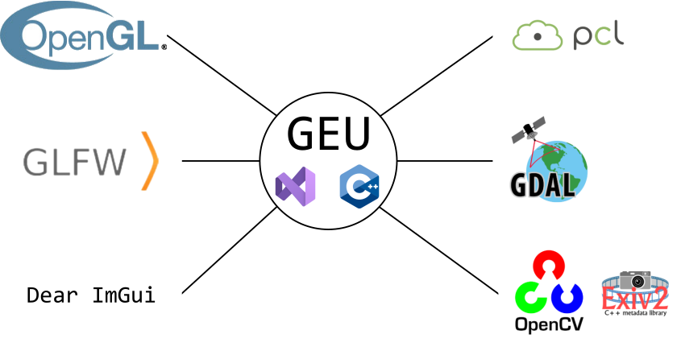

GEU es una aplicación que surge de la intención de agregar, bajo un mismo conjunto, diversas utilidades y métodos relativos al uso y gestión de nube de puntos. Al incorporar múltiples métodos diversos, el listado de dependencias y sistemas externos vinculados al uso de GEU aumenta con cada actualización; esta página resume la arquitectura interna de la aplicación, detallando qué sistemas o librerías se utilizan.

# Núcleo ⭕

||
|:-:|
|Diagrama de librerías utilizadas por el núcleo de GEU|

### Entorno de desarrollo: *C++* y *Visual Studio*

Dados los requisitos que GEU debe alcanzar (amplio catálogo de funcionalidades, extensible y con respuesta en tiempo real), utiliza el lenguaje de programación C++, que permite controlar estrictamente el uso de recursos del sistema.

Además, la aplicación es generada mediante un proyecto del entorno de desarrollo (o *IDE*) *Visual Studio 2022*. Una de las principales ventajas de éste se encuentra en la integración de la herramienta *vcpkg*, un gestor de paquetes externos para C++ que simplifica en gran medida la labor de integración de librerías con el código fuente.

### Librerías de gráficos 3D: *OpenGL* y *GLFW*

En cuanto a la visualización de gráficos 3D, GEU utiliza *OpenGL* como interfaz de programación principal, junto a *GLFW* para la gestión de ventanas y entrada/salida con la aplicación. Aunque existen alternativas a *OpenGL* como *Vulkan* con un mayor potencial respecto al rendimiento, requieren un esfuerzo mucho mayor para alcanzar estas mejoras.

Compaginando las posibilidades de *OpenGL* a los avances en calidad del hardware y nuevos métodos de renderizado permiten que GEU mantenga un gran rendimiento incluso frente a escenas con nubes de puntos densas (millones de puntos).

### Interfaz gráfica de usuario: *Dear ImGui*

*Dear ImGui* es una librería para C++ dedicada a la interfaz gráfica de usuario, integrada directamente sobre el flujo de renderizado. Cuenta con un rendimiento muy optimizado y no requiere dependencias adicionales, simplificando considerablemente su integración.

Aunque suele utilizarse en herramientas como motores gráficos con un enfoque más orientado a depuración, es completamente personalizable; por estos motivos, es la librería utilizada en GEU para todas las necesidades relativas a la interfaz gráfica de usuario.

### Nubes de puntos: *PCL*

Ya que GEU se centra exclusivamente en el procesamiento de nubes de puntos, la librería *PCL* supone un gran añadido con multitud de operaciones resueltas (segmentación, filtrado, construcción de estructuras espaciales, etc.).

Aunque internamente GEU cuenta con un manejo propio de las nubes de puntos cargadas (por motivos de rendimiento y control de los datos), también integra *PCL*  y permite el traspaso de información con poco esfuerzo.

### Información geoespacial: *GDAL*

La mayoría de funcionalidades que ofrece GEU dependen de información geoespacial para resolver cuestiones como el alineamiento de información, ya que los datos de entrada provienen de capturas tomadas sobre entornos rurales. *GDAL* es una librería que abstrae el acceso a esta información ubicada en metadatos de diferentes tipos de archivo, aligerando el proceso de carga desde GEU.

### Manejo de imágenes: *OpenCV* y *Exiv2*

Por último, es común que, al trabajar con datos procedentes de satélite o capturas de sensores anclados a drones, sea necesario manejar imágenes raster. *OpenCV*, siendo la principal librería de visión por ordenador, ofrece su interfaz de programación en la mayoría de lenguajes y sistemas, incluyendo C++. Al integrar *OpenCV*, es posible cargar y realizar operaciones avanzadas sobre imágenes desde GEU.

Simultáneamente, gran parte de las imágenes tratadas cuentan con información esencial entre sus metadatos (sensor utilizado, detalles del formato, geolocalización, etc.). Mediante *Exiv2*, GEU es capaz de acceder a estos metadatos e incluso editarlos si fuese necesario.

# Conexiones remotas 🌐

||
|:-:|
|Diagrama de los sistemas utilizados como conexiones remotas desde GEU|

### Servidor de almacenamiento NAS: *Synology* y *FTP*

La información geoespacial y multisensorial tratada en GEU se caracteriza por tomar un elevado espacio de almacenamiento en disco. Para aliviar este problema, el grupo cuenta con un servidor privado en la red local de almacenamiento masivo, donde los distintos miembros del grupo pueden guardar los datos capturados en su trabajo de campo.

Con objeto de facilitar el acceso a esos datos, eliminando el paso intermedio de tener que acceder al servidor y descargarlos, GEU hace posible la comunicación con este servidor así como la descarga y subida de ficheros mediante el protocolo *FTP*.

### Base de datos: *Oracle*

El conjunto de datos mencionado anteriormente incorpora otro problema: organizar información procedente de varias ubicaciones, herramientas y personas requiere un esfuerzo conjunto y controlado. Ante esto, el grupo también cuenta con una base de datos *Oracle* remota estructurada a partir de las necesidades presentes y futuras.

Toda la gestión de esta base de datos se realiza externamente desde las propias herramientas de *Oracle*, pero *GEU* también es capaz de conectarse a ella para realizar consultas estructuradas de los datos disponibles en el servidor NAS. Esta conexión queda resuelta con la interfaz de *Oracle C++ Call Interface* (*OCCI*), la cual habilita establecer y manejar conexiones, además de realizar consultas *SQL*.
