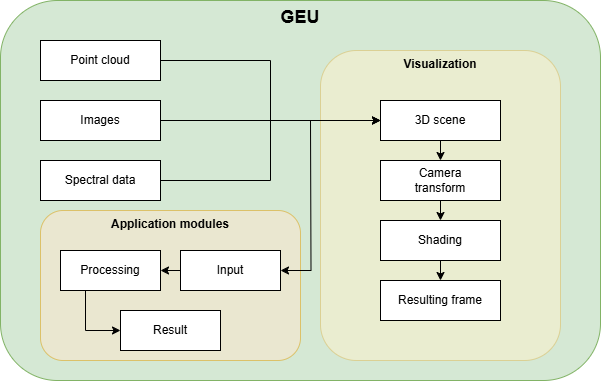
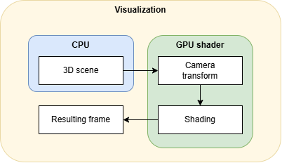

# Ciclo de visualización

GEU implementa [OpenGL](https://www.opengl.org/) como motor de renderizado, soportado por [GLFW](https://www.glfw.org/) para la gestión de entrada/salida e [ImGUI](https://github.com/ocornut/imgui) como librería de interfaz gráfica de usuario.

||
|:-:|
|Ciclo de visualización en GEU|

## Clase *Renderer*

Toda la funcionalidad relativa a visualización queda centralizada en una clase, pero no se limita a ella: el objetivo de esta clase es simplificar el bucle de dibujado y encapsular otras funciones tal que sean gestionadas automáticamente.

Respecto al diagrama presentado al inicio de esta página, la clase *Renderer* encapsula los pasos mostrados en el apartado de visualización: el manejo de escenas, aplicar las transformaciones necesarias, sombreado y la comunicación con *OpenGL* para generar el fotograma final.

### Gestión de escenas

Una escena no es más que una colección de objetos que pueden mostrarse o influyen en la visualización en 3D: cámaras virtuales, luces, modelos 3D, nubes de puntos e imágenes. Asignar cada dato a una escena permite diferenciar varias instancias, como si de ficheros separados se tratase, con datos y tratamientos distintos sin que una involucre en la otra.

De esta manera, a la hora de realizar el proceso de renderizado, GEU agrupa todas las propiedades y objetos de la escena activa y las traspasa al sombreador. Desde GPU, los sombreadores implementados se encargan de los detalles específicos y transformaciones necesarias, dotando a los objetos visibles de color y una posición en lo que será el cuadro final. Al finalizar una pasada (recorrer todos los píxeles), el fotograma se traslada a la salida de vídeo para mostrarse en pantalla.

Este ciclo se realiza decenas de veces por segundo, pues se requiere una ejecución en tiempo real para que los usuarios puedan interactuar con la aplicación; de ahí, nuevamente, que se requieran múltiples optimizaciones que aseguren minimizar el tiempo de respuesta.

||
|:-:|
|Nube de puntos visualizada con la aplicación de escritorio GEU|

