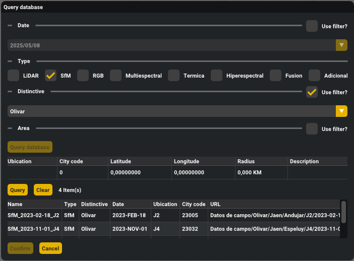

# Servidores de almacenamiento

Además de utilizar datos directamente procedentes de sensores o herramientas de captura, GEU mantiene una conexión con dos servidores ubicados en la Universidad de Jaén accesibles por los miembros del grupo. Esto permite una mejor cohesión sobre la localización de los datos para cuando sean necesarios, así como un método de almacenamiento masivo ajeno a equipos personales y con varias capas de seguridad y resiliencia.

## Almacenamiento masivo

Las nubes de puntos con las que trabajamos son realmente masivas, con varias tomas durante meses o años e información adicional por punto más allá de simplemente color y posición. Es muy común tratar con nubes que ocupen hasta decenas de GB en disco, con millones de puntos, a las que, además, se vinculan tomas de otros tipos de sensores.

Al disponer de un servidor NAS de [Synology](https://www.synology.com/es-es) común para el grupo, todos estos datos y los generados en el futuro pueden almacenarse en un mismo punto, aliviando la gestión de los mismos. Para estructurar los ficheros en el NAS y que no torne en una amalgama de datos sin organización, proponemos una estructura de directorios del tipo `Distintivo/Provincia/Municipio/Zona/Fecha/TipoDato`, donde:

 - **Distintivo** es un término general que describe el principal objeto de escaneo que se encontrará. Por ejemplo, si el vuelo se ha realizado sobre un olivar, el distintivo será Olivar. Dado que es un término algo ambiguo, se deja libertad al usuario para indicarlo, aunque deberá mirar los que ya hay disponibles para intentar mantener una coherencia (que no exista Olivar y Olivos cuando ambos representan lo mismo)
 - Tanto **Provincia** como **Municipio** son triviales y no requieren explicación.
 - **Zona** debe de ser un nombre identificativo de la zona de vuelo, teniendo en cuenta la provincia y el municipio. Por ejemplo, utilizar “Castillo” como nombre de zona no sería suficientemente explicativo de por sí, pero al indicar Jaén como provincia y Jaén como municipio queda claro que zona es. Por otro lado, usar “Hospital” como nombre de zona teniendo Jaén de provincia y municipio no es suficientemente explicativo, dado que hay dos hospitales en Jaén. 
 - **Fecha** indica cuándo ha realizado el vuelo o la captura en el siguiente formato: `aaaa-mm-dd`. De esta manera, un vuelo realizado el día 23 de noviembre de 2022 tendría 2022-11-23 como fecha.
 - **TipoDato** define de qué tipo de dato se trata lo que haya en esa carpeta. Por ejemplo, si son imágenes RGB, TipoDato será RGB. Si son imágenes multiespectrales, TipoDato será Multiespectral. A continuación se enumera los posibles valores:
   - LiDAR: Para nubes de puntos LiDAR.
   - SfM: Para nubes de puntos generadas con SfM. 
   - RGB
   - Multiespectral
   - Termica
   - Hiperespectral
   - Fusion: Resultados de la fusión de datos. El nombre del fichero deberá de indicar de qué datos se han fusionado.
   - Adicional: Los ficheros adicionales que puedan resultar de interés para procesamiento posterior.

A partir de esta información relativa a cada dato específico, se obtendrá una ruta en la que almacenar todos los ficheros de una captura. Como ejemplo, supongamos que se ha volado en el castillo de Campillo de Arenas el día 15 de Mayo de 2023 con un dron equipado con cámaras RGB, multiespectral y térmica. Utilizando SfM, se ha generado una nube de puntos de la cámara RGB. El principal objeto de escaneo ha sido el castillo. En este ejemplo, tenemos 4 tipos de datos: SfM, RGB, multiespectral y térmica. También disponemos de ficheros adicionales generados por el método SfM. Por tanto, tendremos los siguientes directorios:

```
Castillos/Jaen/Campillo de arenas/Castillo/2023-05-15/SfM
```

```
Castillos/Jaen/Campillo de arenas/Castillo/2023-05-15/Adicional
```

```
Castillos/Jaen/Campillo de arenas/Castillo/2023-05-15/RGB
```

```
Castillos/Jaen/Campillo de arenas/Castillo/2023-05-15/Multiespectral
```

```
Castillos/Jaen/Campillo de arenas/Castillo/2023-05-15/Termica
```


## Base de datos

Con el objetivo de facilitar la asignación de las rutas anteriores a cada captura realizada, el uso del servidor NAS se compagina con una base de datos relacional [Oracle](https://www.oracle.com/es/database/technologies/) en la que mantener metadatos adicionales. Como añadido, se utiliza un campo y varias tablas adicionales para el resto de proyectos ajenos a GEU, sirviendo como lugar central de recopilación de datos y resultados.

Un esquema tan general incorpora gran complejidad en su estructura, pero en el caso de GEU se limita a ciertas tablas concretas para la obtención de datos y subida de resultados. Ya que realmente la información se localiza en el servidor NAS, los metadatos almacenados en la base de datos permiten obtener la ruta concreta donde se ubican; así, las consultas pueden aprovechar esos metadatos como filtros para especificar detalles y localizar datos concretos.

||
|:-:|
|Formulario de consulta y descarga desde la base de datos en GEU|

## Subida de datos

Debido a la estructura propuesta para los datos ubicados en el servidor NAS, a la hora de subirse será necesario incluir, también, todos los metadatos correspondientes que permitan formar la ruta y mantener la coherencia relacional en la base de datos.

En resumen, pese a disponer de los datos en el servidor NAS, será la base de datos la fuente principal de consulta: cualquier información que no esté presente en la base de datos será invisible para GEU y no podrá accederse a ella.
