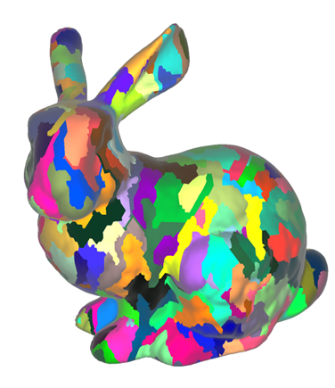

# Sombreadores

La generación de fotogramas se destina exclusivamente al hardware especializado, GPU, mediante unos programas denominados sombreadores. Estos programas indican a la GPU qué operaciones realizar con los datos que recibe de tal forma que, desde una serie de parámetros (posiciones de objetos, fuentes de luz, propiedades de la cámara, etc.) sea capaz de generar todos los píxeles que constituyen el fotograma a visualizar en pantalla.

## Sombreadores de cómputo

Con este enfoque, se libera una carga enorme del procesador central, CPU, y la visualización queda relegada en un procesador especializado considerablemente más eficaz pero dedicado solo a tareas que operen con valores flotantes en su mayoría.

Sin embargo, es posible implementar [sombreadores de cómputo](https://www.khronos.org/opengl/wiki/Compute_Shader) para generalizar el uso de la GPU como una etapa adicional mucho más personalizable durante el proceso de generación de un fotograma. GEU aplica esta etapa como principal fuente de optimización para el renderizado, pues permite aplicar y manejar el *meshlet* directamente en la GPU.

### La estructura del *meshlet*

Por parte de Nvidia, desde su arquitectura <i>Turing</i> especializada en el trazado de rayos, incluyen una etapa adicional de sombreador de cómputo dedicada a mallas de triángulos (<a href="https://developer.nvidia.com/blog/introduction-turing-mesh-shaders/">https://developer.nvidia.com/blog/introduction-turing-mesh-shaders/</a>). Como objetivo principal, esta etapa compacta mallas complejas en subdivisiones mucho menores, denominadas <i>meshlet</i>, aprovechando el uso de varios hilos de cómputo, que el resto del ciclo de renderizado puede utilizar directamente.

En la imagen situada a la derecha, cada "parche" de un mismo color equivale a un <i>meshlet</i>, formados mediante la agrupación de triángulos cercanos.

Aplicado a nubes de puntos, estas agrupaciones se componen de puntos individuales y comparten la mayoría de propiedades que al aplicarse sobre mallas de triángulos. De hecho, utilizar únicamente puntos elimina la necesidad de mantener la topología que caracteriza a una malla de triángulos: simplificar una malla necesita recalcular nuevas caras y aristas, mientras que simplifcar un conjunto de puntos solo requiere seleccionar un subconjunto.

Ya que el objetivo del *meshlet* es simplificar la escena 3D reduciendo la cantidad de primitivas, su generación debe priorizar la agrupación de primitivas cercanas espacialmente (carece de sentido, por ejemplo, conjuntar triángulos pertenecientes a brazos opuestos de un personaje modelado, o los puntos de árboles ubicados en extremos opuestos de una finca en el caso de una nube de puntos). Si bien la falta de topología facilita algunas operaciones al tratar con nubes de puntos, dificulta en parte la búsqueda de puntos próximos espacialmente.

La solución integrada en GEU solventa este problema mediante una ordenación con [curvas de Hilbert](https://mathworld.wolfram.com/HilbertCurve.html), capaces de atravesar todo el espacio 2D o 3D con un patrón establecido. Es posible utilizar estructuras de datos como *octrees* o *kd-trees*, pero en las pruebas realizadas el uso de curvas de Hilebrt presenta resultados positivos de forma general (siempre habrá casos donde un método se adapte mejor que otro a la escena). Una vez disponible la búsqueda de puntos cercanos, se toman grupos de un tamaño fijo definido, comúnmente, por el fabricante del hardware.

||
|:-:|
|Ejemplo de curva de Hilbert sobre un espacio tridimensional. Extraído de [https://eisenwave.github.io/voxel-compression-docs/rle/hilbert_curves.html](https://eisenwave.github.io/voxel-compression-docs/rle/hilbert_curves.html)|

Nada mas cargar una nube de puntos, mediante la ordenación espacial dada por la curva anterior define las agrupaciones de puntos que forman cada <i>meshlet</i>, y a continuación pueden utilizarse para cualquier operación. GEU aplica dos optimizaciones simultáneas a partir del <i>meshlet</i>. Primero, evalúa el descarte de puntos pertenecientes a cada uno: cuando está situado lejos de la cámara virtual, su tamaño en la imagen será menor en una vista perspectiva, pudiendo originar situaciones en que varios puntos ocupen un mismo píxel. Como solución, el descarte elige puntos al azar según la distancia a la cámara, eliminado la mayoría de puntos para <i>meshlet</i> lejanos y manteniendo la mayoría para los más cercanos.

Por otro lado, la etapa de recorte o <i>culling</i> también puede trabajar a nivel de <i>meshlet</i>: si la caja envolvente alineada (<i>Axis-Aligned Bounding Box</i> o <i>AABB</i>) de los puntos contenidos no intersecta con el volumen de visión de la cámara, pueden recortarse todos sus puntos directamente. Aplicando ambas optimizaciones, GEU permite visualizar nubes con millones de puntos manteniendo una alta tasa de fotogramas, pero involucra el uso de hardware de Nvidia con altas prestaciones y reciente, pues las generaciones de tarjetas gráficas anteriores a <i>Turing</i> no son compatibles con las tecnologías implementadas y deben usar el ciclo clásico de renderizado.

A la derecha de estos párrafos se presenta una muestra del recorte realizado sobre una nube de puntos; aunque no es el efecto tal cual resulta en la implementación de GEU, debería aportar una idea general sobre qué ocurre internamente. En resumen, los puntos fuera del campo de visión o muy alejados de la cámara se recortan para reducir el número de primitivas que deben dibujarse cada fotograma. El uso de meshlets permite trabajar con agrupaciones de puntos en lugar de puntos individuales, simplificando aún más el coste computacional de este proceso.

    
    
Simulación del efecto de recorte, realizado en Godot 4.4

||
|:-:|
|*Meshlets* de una nube de puntos visualizada con la aplicación de escritorio GEU|
