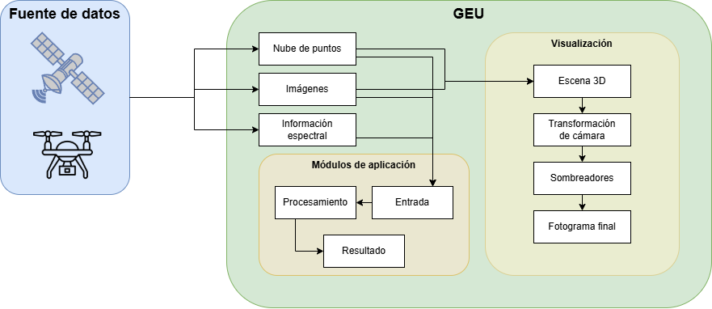
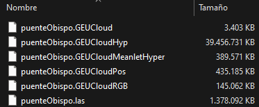
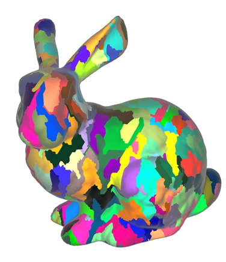
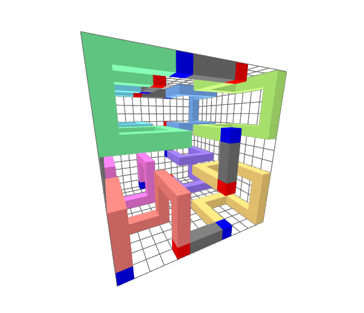
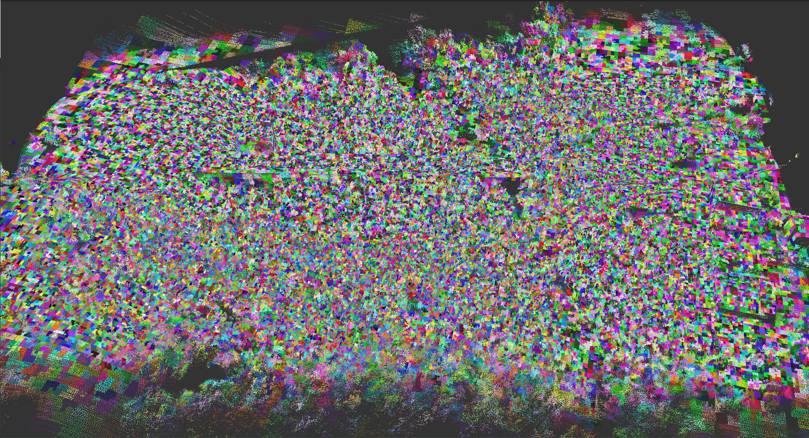

El conjunto de utilidades que ofrece GEU parten de un núcleo central común a todos los módulos implementados para la aplicación; este núcleo, por tanto, se dedica a dar soporte a las operaciones más básicas: control de la información interna, la visualización e interacción en tiempo real y el procesamiento de los datos según distintos métodos.

||
|:-:|
|Flujo de datos en GEU|

## Procesamiento interno de datos

### Fuentes de datos

Cualquier operación realizada en GEU requiere, previamente, de un conjunto de datos preparado para su procesamiento que puede tomarse desde distintas fuentes, algunas mediante trabajo de campo y otras con servicios en línea con acceso a satélites:

- **Sensores Lidar**: devuelven como resultado una nube de puntos del terreno escaneado.
- **Cámaras RGB**: a partir de un conjunto de imágenes, es posible obtener una nube de puntos con procesos como *SfM*.
- **Sensores espectrales**: capturas de información sobre distintas longitudes de onda del espectro electromagnético.
  - **Térmica**: una única longitud de onda, dada en formato de imagen raster.
  - **Multiespectral**: varias longitudes de onda o bandas, dadas mediante una imagen raster por banda.
  - **Hiperespectral**: cientos de bandas, dadas en un *hipercubo* o imagen 3D, apilando las imágenes raster de cada banda.

Una vez se han tomado datos, requieren, generalmente, un preprocesamiento antes de poder utilizarse con GEU. Este paso varía según el tipo de dato de entrada y su formato, recurriendo a distintas herramientas software para su preparación:

 - [**CloudCompare**](https://www.cloudcompare.org/): manejo de nubes de puntos y multitud de operaciones. Útil para realizar recorte o muestreo de la nube, reduciendo la cantidad de puntos, o procesos de alineamiento entre varias nubes.
 - [**Pix4d**](https://www.pix4d.com/): suite de herramientas para fotogrametría, capaz de transformar capturas 2D en mapas digitales y modelos 3D (por ejemplo, a nubes de puntos con *SfM*).
 - [**Qgis**](https://qgis.org/): sistema de información geográfica empleado para la visualización y el alineamiento de los datos captados.
 - [**HyperSpec** y **SpectralView**](https://headwallphotonics.com/products/software/hyperspec-iii-and-spectralview/): Herramientas para la toma y gestión de capturas hiperespectrales, con funcionalidad adicional como visualización y clasificación espectral.

Al finalizar el preprocesamiento de los datos que lo requieran, el conjunto puede almacenarse para su uso en GEU y que sea accesible en cualquier momento. Esto se consigue con el uso del servidor NAS para almacenamiento masivo, donde quedan guardados los datos, y una base de datos relacional que aporte una estructura a los datos del servidor NAS.

La subida de un nuevo dato, por tanto, requiere generar una entrada con diversos metadatos sobre el conjunto en la base de datos mediante formularios, continuado por la subida al servidor NAS en una ruta especificada. Al seguir la estructura definida, GEU puede acceder con precisión a cualquier dato disponible y realizar búsquedas concretas mediante varios filtros durante la consulta.

### Carga de datos: nubes de puntos

A la hora de importar una nube de puntos en GEU, se hace uso de los formatos estándar PLY y LAS/LAZ. Ambos cuentan con una cabecera de metadatos sobre los puntos incluidos, por ejemplo: desplazamiento (*offset*, define la posición de la nube en el sistema de coordenadas local), tipos de datos adicionales (color, normales, o cualquier otro valor añadido a cada punto), o posición geográfica.

La carga de una nube, aunque difiera en formatos de entrada, sigue el mismo esquema para ambos en el cual se leen primero los metadatos y, a continuación, quedan almacenados los valores de cada punto para todas las propiedades que incluyan. Internamente, todos estos valores por punto son gestionados en una clase propia utilizando colecciones comunes, principalmente vectores de tamaño dinámico.

Si bien este proceso es considerablemente simple, GEU realiza una serie de optimizaciones internas que garantizan el mejor rendimiento posible durante la visualización de escenas más complejas o de gran tamaño. Una vez todos la posición de todos los puntos ha sido leída desde el fichero, como primer paso de optimización, esos puntos se ordenan espacialmente, recibiendo cada uno un índice relativo a su posición en la escena. A continuación, el conjunto entero de puntos se subdivide en agrupaciones mucho menores, dando lugar a la estructura del *meshlet* que será detallada más adelante ([La estructura del *meshlet*](#la-estructura-del-meshlet)).

Durante la carga, antes de poblar las estructuras internas de la nube de puntos, su contenido es almacenado en varios ficheros generados por GEU en formato binario que permitan una lectura mucho más eficiente si el mismo archivo vuelve a cargarse. Los metadatos de la nube y cada propiedad de los puntos se mantiene en un fichero distinto (posición, color, bandas espectrales, etc.), permitiendo que cada atributo pueda accederse independientemente conforme sea necesario durante la ejecución.

||
|:-:|
|Ficheros generados por GEU en el explorador de Windows|

### Nubes de puntos espectrales

Una de las funcionalidades principales de GEU permite fusionar datos espectrales sobre cada punto de la nube. Esto supone que, a cada punto, se le añade uno o varios valores extraídos de los datos de entrada, estructurados también mediante vectores. Según el dato espectral y las características del sensor empleado, el vector para cada tipo tendrá un tamaño fijo conocido de antemano (por ejemplo, los datos térmicos solo cuentan con una banda, mientras que los multiespectrales toman hasta 6 bandas).

Ya que no toda la información espectral se utiliza continuamente, es aquí donde destaca la división en ficheros según cada parámetro: por defecto, solo es necesario cargar la posición y el color de todos los puntos para visualizar la nube; será al trabajar con un tipo de dato espectral concreto cuando se realizará la carga de dicha información.

### Carga de datos: imágenes

Además de nubes de puntos, la principal fuente de datos geográficos y multisensoriales viene dada mediante imágenes. Afortunadamente, el manejo de imágenes es un problema muy común para el cual existen multitud de soluciones de gran calidad. GEU hace uso de [OpenCV](https://opencv.org/) como método principal de manejo de imágenes raster, pues facilita, además, el acceso a cada píxel de la imagen individualmente.

## Visualización

De forma automática, el siguiente paso a la carga de información es visualizar esos datos; GEU es una aplicación gráfica e interactiva, por lo que asegurar una visualización precisa y eficiente lo antes posible mejorará considerablemente la experiencia de usuario.

### Ciclo principal de renderizado

Como cualquier aplicación gráfica, el proceso de renderizado parte de una escena con múltiples elementos dispuestos sobre el espacio 3D, con múltiples fuentes de luz y al menos una cámara virtual que defina los parámetros de visualización. Esta escena cuenta con un sistema de coordenadas propio sobre tres ejes direccionales, colocando el resto de objetos sobre este mismo sistema local.

A continuación, conociendo los distintos elementos dispuestos en la escena, el sistema de coordenada se traslada al sistema local de la cámara virtual activa; los movimientos de traslación, rotación y escalado que deben aplicarse a todos los objetos quedan definidos por una matriz de transformación, que permite este cambio de sistemas de coordenadas. Esta transformación no solo coloca la escena considerando a la cámara virtual como origen, también la redimensiona para ajustarse a un volumen unitario, que facilita enormemente los cálculos posteriores.

Tal volumen cuenta con dos planos de recorte, situados próximo y lejano a la cámara en posiciones especificadas de la dirección hacia la que observa. Ambos planos, junto al volumen mencionado anteriormente, define la región del espacio a visualizar: aquellos objetos fuera de los límites que establecen son ignorados y no aparecerán en la imagen final. Por último, el contenido del volumen se proyecta hacia el plano cercano, cuya intersección con el volumen de visión forma un rectángulo que define la imagen captada. Con un proceso final de rasterización, la información contenida en este rectángulo genera los píxeles de color y una imagen que puede mostrarse en pantalla.

Todo el ciclo anterior, desde que se toma la escena hasta que se genera la imagen o *fotograma*, se repite constantemente, idóneamente cada pocos milisegundos. Una mayor tasa de fotogramas da lugar a un sistema interactivo y una mejor experiencia de usuario, por lo que debe asegurarse un proceso eficiente de renderizado.

Con objeto de asegurar esta eficiencia, el hardware dedicado a gráficos es capaz de manejar las operaciones necesarias mucho mejor que los procesadores comunes: el ciclo de generar un fotograma se realiza casi por completo en este hardware, y es tarea del procesador principal comunicar y recibir la información relevante. Aunque algunas etapas son automáticas, los desarrolladores pueden controlar con precisión el comportamiento del hardware mediante somberadores o *shaders*, pequeños programas que definen las instrucciones a realizar en una etapa.

||
|:-:|
|Nube de puntos visualizada con la aplicación de escritorio GEU|

Enfocado a OpenGL, la [documentación oficial](https://www.khronos.org/opengl/wiki/Rendering_Pipeline_Overview) del grupo Khronos expone en detalle los pasos a seguir por el hardware, dividos en etapas con sombreadores especializados para cada una.

### La estructura del *meshlet*

El hadrware espcializado en gráficos recibe continuamente multitud de mejoras por parte de distintos fabricantes. Por parte de Nvidia, desde su arquitectura *Turing* especializada en el trazado de rayos, incluyen una etapa adicional de sombreador de cómputo dedicada a mallas de triángulos ([*mesh shaders*](https://developer.nvidia.com/blog/introduction-turing-mesh-shaders/)). Como objetivo principal, esta etapa compacta mallas complejas en subdivisiones mucho menores, denominadas *meshlets*, aprovechando el uso de varios hilos de cómputo, que el resto del ciclo de renderizado puede utilizar directamente.

||
|:-:|
|Ejemplo de subdivisión de una malla 3D en *meshlets*. Extraído de [https://developer.nvidia.com/blog/introduction-turing-mesh-shaders/](https://developer.nvidia.com/blog/introduction-turing-mesh-shaders/)|

Aplicado a nubes de puntos, estas agrupaciones se componen de puntos individuales y comparten la mayoría de propiedades que al aplicarse sobre mallas de triángulos. De hecho, utilizar únicamente puntos elimina la necesidad de mantener la topología que caracteriza a una malla de triángulos: simplificar una malla necesita recalcular nuevas caras y aristas, mientras que simplifcar un conjunto de puntos solo requiere seleccionar un subconjunto.

Ya que el objetivo del *meshlet* es simplificar la escena 3D reduciendo la cantidad de primitivas, su generación debe primar la agrupación de primitivas cercanas espacialmente (carece de sentido, por ejemplo, conjuntar triángulos pertenecientes a los brazos de un personaje modelado, o los puntos de árboles ubicados en extremos opuestos de una finca en el caso de una nube de puntos). Si bien la falta de topología facilita algunas operaciones al tratar con nubes de puntos, dificulta en parte la búsqueda de puntos próximos espacialmente.

La solución integrada en GEU solventa este problema mediante una ordenación con [curvas de Hilbert](https://mathworld.wolfram.com/HilbertCurve.html), capaces de atravesar todo el espacio 2D o 3D con un patrón establecido. Es posible utilizar estructuras de datos como *octrees* o *kd-trees*, pero en las pruebas realizadas el uso de curvas de Hilebrt presenta resultados positivos de forma general (siempre habrá casos donde un método se adapte mejor que otro a la escena). Una vez disponible la búsqueda de puntos cercanos, se toman grupos de un tamaño fijo definido, comúnmente, por el fabricante del hardware (en nuestro caso, potencias de 2, variable según el número de puntos).

||
|:-:|
|Ejemplo de curva de Hilbert sobre un espacio tridimensional. Extraído de [https://eisenwave.github.io/voxel-compression-docs/rle/hilbert_curves.html](https://eisenwave.github.io/voxel-compression-docs/rle/hilbert_curves.html)|

En este punto, los *meshlets* han sido construidos y pueden utilizarse para cualquier operación, destacando el proceso de dibujado y varias de sus etapas internas. GEU aplica dos optimizaciones simultáneas a partir del *meshlet*. Primero, evalúa el descarte de puntos pertenecientes a cada agrupación: cuando está situado lejos de la cámara virtual, su tamaño en la imagen será menor cuanta mayor distancia al usar una vista en perspectiva, pudiendo originar situaciones en que varios puntos ocupen un mismo píxel. Ante esto, el descarte elige puntos al azar según la distancia a la cámara, eliminado la mayoría de puntos para *meshlets* lejanos y manteniéndolos para los más cercanos. Así, se reduce considerablemente la cantidad de primitivas por dibujar a la vez que se mantiene una elevada calidad visual de la escena.

Por otro lado, la etapa de recorte o *culling* también puede trabajar a nivel de *meshlet*: si la caja envolvente alineada (*Axis-Aligned Bounding Box* o *AABB*) de los puntos contenidos no intersecta con el volumen de visión de la cámara, pueden recortarse todos sus puntos directamente. Aplicando ambas optimizaciones, GEU permite visualizar nubes con millones de puntos manteniendo una alta tasa de fotogramas, pero involucra el uso de hardware de Nvidia con altas prestaciones y reciente, pues las generaciones de tarjetas gráficas anteriores a *Turing* no son compatibles con alguas de las tecnologías implementadas y deben usar el ciclo clásico de renderizado.

||
|:-:|
|*Meshlets* de una nube de puntos visualizada con la aplicación de escritorio GEU|

### Sombreadores de cómputo

En paralelo al uso del *meshlet*, *OpenGL* soporta, desde su versión 4.3, el uso de un sombreador de procesamiento general deniminado [*Compute Shader*](https://www.khronos.org/opengl/wiki/Compute_Shader). Una tarjeta gráfica no es más que un procesador específicamente diseñado para cálculos con valores flotantes, la operación principal en computación gráfica y el proceso de renderizado, pero puede aplicarse a otras necesidades. Ante esto, los *compute shaders* aparecen como una etapa adicional mucho más personalizable por los desarrolladores y ajustarse así a más tareas con un propósito general (ejecución de físicas, manejo de imágenes, experimentación...).

GEU aplica los *compute shaders* en el proceso de renderizado, incorporando así un control preciso sobre los *meshlets* y el resto de información relevante a cada punto.
