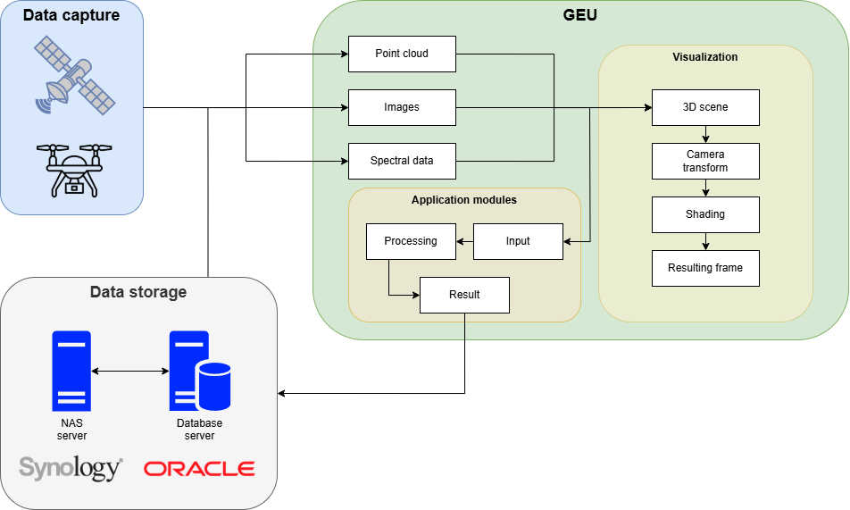
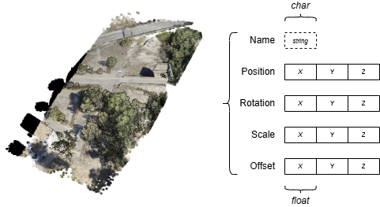
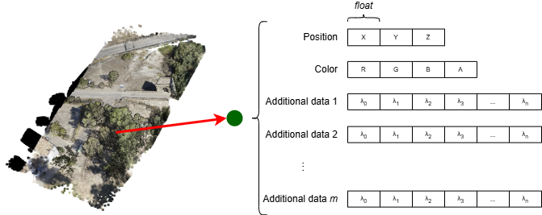

El conjunto de utilidades que ofrece GEU parten de un núcleo central común a todos los módulos implementados para la aplicación; este núcleo, por tanto, se dedica a dar soporte a las operaciones más básicas: control de la información interna, la visualización e interacción en tiempo real y el procesamiento de los datos según distintos métodos.

||
|:-:|
|Flujo de datos en GEU|

## Fuentes de datos

Cualquier operación realizada en GEU requiere, previamente, de un conjunto de datos preparado para su procesamiento que puede tomarse desde distintas fuentes, mediante trabajo de campo o desde servicios en línea con acceso a satélites:

- **Sensores Lidar**: devuelven como resultado una nube de puntos del terreno escaneado.
- **Cámaras RGB**: a partir de un conjunto de imágenes, es posible obtener una nube de puntos con procesos como *SfM*.
- **Sensores espectrales**: capturas de información sobre distintas longitudes de onda del espectro electromagnético.
  - **Térmica**: una única longitud de onda, dada en formato de imagen raster.
  - **Multiespectral**: varias longitudes de onda o bandas, dadas mediante una imagen raster por banda.
  - **Hiperespectral**: cientos de bandas, dadas en un *hipercubo* o imagen 3D, apilando las imágenes raster de cada banda.

Una vez se han tomado datos, requieren, generalmente, un preprocesamiento antes de poder utilizarse con GEU. Este paso varía según el tipo de dato de entrada y su formato, recurriendo a distintas herramientas software para su preparación:

 - [**CloudCompare**](https://www.cloudcompare.org/): manejo de nubes de puntos y multitud de operaciones. Útil para realizar recorte o muestreo de la nube, reduciendo la cantidad de puntos, o procesos de alineamiento entre varias nubes.
 - [**Pix4d**](https://www.pix4d.com/): suite de herramientas para fotogrametría, capaz de transformar capturas 2D en mapas digitales y modelos 3D (por ejemplo, a nubes de puntos con *SfM*).
 - [**Qgis**](https://qgis.org/): sistema de información geográfica empleado para la visualización y el alineamiento de los datos captados.
 - [**HyperSpec** y **SpectralView**](https://headwallphotonics.com/products/software/hyperspec-iii-and-spectralview/): Herramientas para la toma y gestión de capturas hiperespectrales, con funcionalidad adicional como visualización y clasificación espectral.

## Carga de datos en GEU

Internamente, GEU emplea un sistema de gestión de escenas para el manejo de la información a visualizar, similar a otras aplicaciones como *Blender* o *Unity*, presentando un entorno tridimensional sobre el que se posicionan los modelos 3D y nubes de puntos. En el caso de imágenes y otro tipo de información, será cuestión del módulo que requiera esos datos la manera de representarlos, si fuese necesario.

### Nubes de puntos

A la hora de importar una nube de puntos, se hace uso de los formatos PLY<a href="#fn1">1</a> y LAS/LAZ<a href="#fn2">2</a>. Ambos cuentan con una cabecera de metadatos sobre los puntos incluidos que permiten al sistema cargar y organizar la información automáticamente, y deben contar con, al menos, la posición en el espacio de los puntos.

Durante la carga, GEU accede a la información del fichero y la replica en una estructura de datos interna optimizada para las necesidades de la aplicación. Tal estructura, a su vez, queda escrita en ficheros según los parámetros que contiene: siempre habrá, al menos, un fichero de cabecera (metadatos sobre la nube) y otro de posición, añadiendo más ficheros por cada atributo adicional que incluyan los puntos (color, normales, información espectral...).

Con objeto de garantizar una visualización eficiente de nubes de puntos masivas, durante la carga se aplican una serie de optimizaciones que desembocan en una organización por *meshlet*. Para una explicación detallada del funcionamiento de estas estructuras de datos y los métodos empleados, visite [Sombreadores](/Usuario/Documentacion/FlujoInformacionGEU/Sombreadores/).

### Imágenes

Gran parte de los datos captados externamente son aportados como imágenes y metadatos respectivos, incorporando la información geoespacial y multisensorial. GEU implementa las librerías [OpenCV](https://opencv.org/) y [Exiv2](https://exiv2.org/) dedicadas a la lectura y manejo de imágenes y metadatos, respectivamente, haciendo uso de una estructura interna capaz, además, de enlazar la imagen para su visualización en pantalla.

### Información espectral

Como principal característica de GEU, la fusión de datos espectrales permite combinar en la misma nube de puntos la información multisensorial asociada a la región que representa. Utilizando el mismo sistema mencionado anteriormente, este añadido será gestionado con ficheros adicionales relativos al tipo de sensor (térmico, multiespectral e hiperespectral) y será consultado conforme sea necesario dada la inmensidad de información con la que se trata.

Sobre esto último, ya que no toda la información espectral se utiliza simultáneamente, GEU solo cargará los datos cuando se requieran. Por ejemplo: durante la visualización, por defecto se mostrará la nube de puntos con su color escaneado RGB, y, cuando el usuario quiera ver la intensidad térmica por punto, el fichero correspondiente se leerá y dicha información será cargada internamente.

En paralelo, las mismas optimizaciones mencionadas anteriormente ([Sombreadores](/Usuario/Documentacion/FlujoInformacionGEU/Sombreadores/)) también se destinan a minimizar el impacto en recursos del sistema al emplear información espectral sobre una nube de puntos.

|||
|:-:|:-:|
|Estructura de datos con parámetros generales de una nube de puntos|Estructura de datos sobre cada punto de una nube de puntos|

## Servidores de almacenamiento

Una vez se ha realizado cualquier procesamiento con una serie de datos de entrada, la salida generada en GEU puede exportarse a los servidores de almacenamiento remoto, organizados en una base de datos estructurada que mantiene la coherencia y conexiones entre datos individuales, junto a un servidor NAS destinado al almacenamiento masivo. Visite [Servidores de almacenamiento](/Usuario/Documentacion/FlujoInformacionGEU/ServidoresAlmacenamiento) para una explicación especializada sobre la conexión y estructura de estos servidores.

1: <a href="https://pointclouds.org/documentation/classpcl_1_1_p_l_y_reader.html">Referencia a la función de lectura PLY en PCL 1.15</a>

2: <a href="https://www.asprs.org/wp-content/uploads/2019/07/LAS_1_4_r15.pdf">Especificación LAS 1.4</a>
