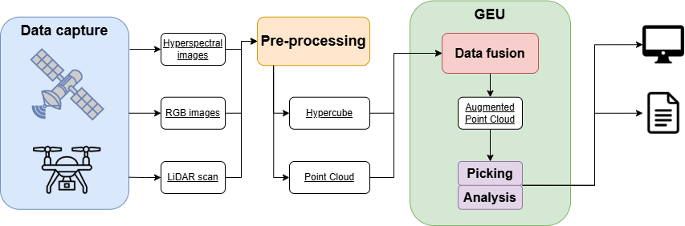
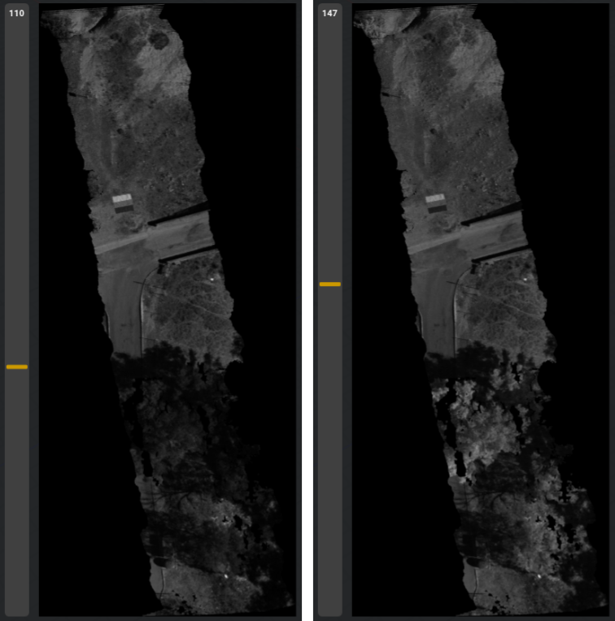

GEU habilita, de forma genérica, la [selección de puntos](/Usuario/Documentacion/SeleccionPuntos/) de una nube en tiempo real, delimitando regiones en pantalla o mediante posiciones individuales. Aprovechando esta funcionalidad, resulta de interés explorar el comportamiento de los datos con los que trabaja la aplicación, especialmente capturas hiperespectrales al ser las más densas y con mayor potencial de explotación.

    

# Uso de las bandas hiperespectrales

Al trabajar con capturas hiperespectrales contamos, a diferencia de otros sensores, con cientos de bandas (según el modelo y configuración del sensor empleado) espectrales disponibles a distintas longitudes de onda, todo sobre la misma zona escaneada. Mediante GEU, es posible fusionar estas capturas a una nube de puntos correspondiente a esa zona y añadir así una dimensión más al estudio; contar con la profundidad puede resultar útil para ciertos cálculos o en procesos de selección con más precisión.

## Datos 2D y 3D

Reiterando en lo anterior, las capturas hiperespectrales provienen de sensores generalmente como imágenes, pero GEU recurre al uso de nubes de puntos 3D. Mediante la fusión de ambas, obtenemos las ventajas de ambos mundos: un gran repertorio de información espectral y su coherencia espacial en un escenario tridimensional.

Desde GEU pueden manejarse tanto las imágenes hiperespectrales como las nubes de puntos fusionadas, facilitando al usuario el acceso a la información de cualquier tipo; en ocasiones, bastará con hacer uso de las imágenes, sin pasar por una nube de puntos.

## Visualización

En primer lugar, cualquier dato hiperespectral cargado en GEU puede visualizarse desde la propia aplicación, tanto como una imagen ráster al uso o mediante el color de los puntos de una nube. Para el formato de imagen, accesible a la hora de fusionar datos hiperespectrales, se muestra en pantalla una previsualización para una banda determinada que puede modificarse en tiempo real para alterar la longitud de onda mostrada.

En cuanto a nubes de puntos, sigue existiendo la limitación de una única banda visible, pues se asocia el color de cada punto al valor de reflectancia respectivo. Durante la fusión, la reflectancia por punto queda normalizada, facilitando la visualización mediante color e incluso permitiendo el soporte a gradientes de color personalizados. Con una nube de puntos hiperespectral cargada en GEU, basta con seleccionar la nube en la jerarquía de escena y marcar la visualización hiperespectral; entre los ajustes de la aplicación puede especificarse un gradiente de color. 

## Selección

Si bien muchos estudios recurren a un análisis global de todo el conjunto de datos, nuestro caso puede requerir reducir el alcance a una región limitada: una línea de vegetación en cultivo o un único individuo aislado, por ejemplo. Por esto, GEU implementa un sistema de selección de puntos directamente sobre la escena 3D con dos métodos, selección individual (toma el punto más cercano a la posición seleccionada en pantalla) o de área (toma todos los puntos contenidos en el rectángulo marcado en pantalla).

Los detalles concretos sobre cómo se encuentra implementada la selección en GEU pueden consultarse en la sección [Selección de puntos](/Usuario/Documentacion/SeleccionPuntos/).

#### Estadísticas de la selección

Una vez se tiene un subconjunto de puntos seleccionados, es posible obtener un resumen de la reflectancia espectral según la disponibilidad de información que incluya la nube de puntos. Conociendo la densidad de los datos hiperespectrales, acceder a todos los valores de reflectancia punto a punto compromete el rendimiento de GEU e imposibilita un tiempo de respuesta a tiempo real.

Ante esto, GEU toma provecho del *meshlet* ([Sombreadores](/Usuario/Documentacion/FlujoInformacionGEU/Sombreadores/)) durante el proceso de fusión para generar una serie de *meanlets* ([Fusión hiperespectral](/Usuario/Documentacion/ModulosGEU/FusionHiperespectral/)) que resuman con precisión la signatura hiperespectral de las agrupaciones de puntos. De esta manera, la selección y obtención de los valores de reflectancia puede realizarse a tiempo real con un resumen de los datos originales sin una pérdida considerable de precisión.

