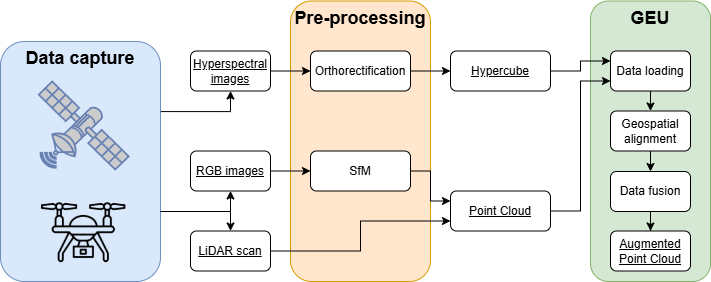
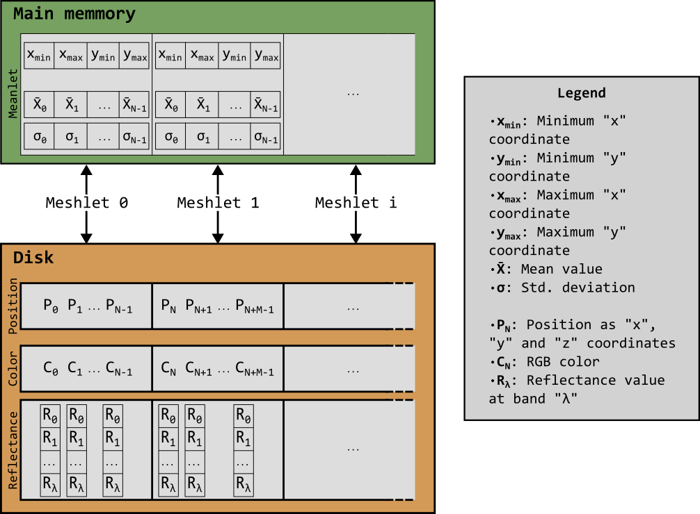

# Fusión hiperespectral

Una captura hiperespectral incorpora ingentes cantidades de información al compararse con el resto de información sensorial que soporta GEU: mientras que las imágenes térmicas utilizan un valor adicional (temperatura) y las multiespectrales rondan los 5 o 6 valores (longitudes de onda concretas o agregaciones de ellas), el sensor hiperpespectral es capaz de tomar cientos de longitudes de onda sobre el espectro electromagnético. En concreto, con los sensores utilizados para la recolección de datos, cada píxel incorpora 270 valores de reflectancia, con una separación aproximada de 3 nanómetros entre sí.

Al igual que el resto de procesos de fusión, los datos hiperespectrales requieren cierto preprocesamiento que facilite el acceso a sus valores y permitan alinear los conjuntos de datos espectrales y espaciales:



Comenzando por el aspecto común, la nube de puntos que representa la zona a aumentar puede obtenerse con un escaneo LiDAR o aplicando un proceso de *SfM* a un conjunto de imágenes RGB.

Para las imágenes hiperespectrales, sin embargo, es necesario un proceso algo más complejo de ortorectificación con el objetivo principal de corregir cualquier distorsión inducida por el sensor. Este proceso se realiza ajeno a GEU en software especializado, dando como resultado la imagen hiperespectral ortorectificada, que denominamos hipercubo al ser una simple apilación de imágenes sobre cada longitud de onda escaneada.

Gracias al proceso de ortorectificación y la presencia de metadatos sobre la posición geográfica de ambos conjuntos de datos, el proceso de fusión en GEU resulta trivial; simplemente cargando la nube de puntos y el hipercubo, su información geográfica permite posicionarlos bajo el mismo sistema de coordenadas y alinearlos con una misma matriz de traslación una vez colocados en el origen:

```
1 0 0 offset_x
0 1 0 offset_y
0 0 1 offset_z
0 0 0 1
```

Antes de detallar cómo GEU asigna los valores hiperespectrales a cada punto, hay más detalles sobre el hipercubo que son relevantes para su uso. En lugar de un fichero único con toda la información, estos hipercubos se dividen en el fichero de datos, donde cada píxel contiene los cientos de valores hiperespectrales, y un fichero de cabecera con  multitud de metadatos de utilidad. Tales metadatos permiten, principalmente, leer correctamente el hipercubo, detallando las dimensiones y número de bandas captadas, pero también incluyen detalles sobre las longitudes de onda específicas, su separación, y algunas propiedades de la cámara empleada.

La librería *GDAL* permite la lectura de un hipercubo de forma nativa, abtrayendo la gestión de estos metadatos en varias clases y funciones ([GDAL - Raster API tutorial](https://gdal.org/en/stable/tutorials/raster_api_tut.html)). Si bien la lectura de los datos es considerablemente simple, surge el gran problema de gestionar tal magnitud de información: los conjuntos de datos hiperespectrales utilizados requieren varios GB de almacenamiento en disco, que deberán reservarse en memoria principal en algún momento.

Ya que la lectura implica acceso a disco, cualquier alternativa presentará una desventaja en tiempo de ejecución o en uso de memoria. Una primera solución planteada consiste en asignar poco a poco los valores, tal que solo quede cargado en memoria una pequeña parte del hipercubo; el problema con este enfoque surge al requerir múltiples accesos a disco, que impactan en gran medida al tiempo de ejecución. Por otro lado, cargar todo el hipercubo en memoria y procesarlo posteriormente, si bien no genera multitud de accesos de lectura, ocupará gran parte de la memoria principal disponible del sistema.

GEU recurre al segundo método al tratar de favorecer el tiempo de respuesta, pues el propio proceso de fusión también es significativamente complejo computacionalmente. En la mayoría de situaciones, la nube de puntos escaneada tendrá una mayor dimensión que el hipercubo, dando lugar a puntos con información vacía. Dado que la fusión se basa en la proyección de un conjunto de datos sobre el otro, aquellos puntos fuera del alcance del hipercubo pueden recortarse y ser ignorados mediante un simple algoritmo:

```c
pointcloud = Point[num_points]
points_inside = Point[]
for Point p in pointcloud:
    if hypercube.georectangle.contains(p.geoposition.x, p.geoposition.y):
        points_inside += p
```

Indagando aún más en el problema anterior, GEU optimiza en gran medida el algoritmo al aprovechar el uso del *meshlet* como una agrupación de puntos (más información en [Flujo de información en GEU](/Usuario/Documentacion/FlujoInformacionGEU/#la-estructura-del-meshlet)). En lugar de comprobar cada punto individualmente, se evalúa si la caja envolvente de cada *meshlet* intersecta con el rectángulo del hipercubo, reduciendo en gran medida el número de comparaciones. Conociendo el conjunto de puntos dentro del hipercubo, la fusión consiste en asignar a cada punto los valores hiperespectrales del píxel al que corresponde, encontrado mediante la proyección del punto 3D a la imagen 2D.

Dada una posición en el espacio 3D, tras la alineación de ambos conjuntos de datos es posible ignorar la profundida en la proyección. A partir del punto con sus coordenadas horizontal y vertical, basta con añadir el desplazamiento geográfico original para que quede colocado en el mismo sistema que los píxeles del hipercubo. Tomando el rectángulo formado por el hipercubo, obtener la posición relativa de un punto en su interior es un problema trivial gracias al uso de *GDAL* ([Geotransform Tutorial](https://gdal.org/en/stable/tutorials/geotransforms_tut.html)), que se resume en la siguiente operación:

```
pixelX = (geoX - topLeftCornerX) / sizeW;
pixelY = (geoY - topLeftCornerY) / sizeY;
```

Mediante el píxel correspondiente a cada punto, la nube queda fusionada tras asignar, a cada uno, la colección de valores hiperespectrales de cada longitud de onda, tal que cada punto en la nube incluya información de su posición, color, y valores hiperespectrales.

## Magnitud de los datos fusionados

Si bien disponer de toda la información espectral en cada punto puede facilitar en gran medida multitud de tareas posteriores, el impacto en el uso de recursos del sistema es un problema crítico. Internamente, un valor flotante queda representado mediante 4 bytes en memoria principal; para un punto cualquiera, su posición viene dada como tres flotates para cada eje direccional, un total de 12 bytes, más un color con cuatro canales (rojo, verde, azul y transparencia) equivalente a otros 16 bytes. Tras la fusión, por cada longitud de onda añadida se incorpora otro flotante más a la colección: para los datos hiperespectrales, si suponemos 250 bandas por punto son necesarios 1000 bytes de almacenamiento.

Siguiendo el conteo anterior, un único punto requeriría 1028 bytes, algo más que un kilobyte (KB). Aplicado a una nube de un millón de puntos, un tamaño relativamente pequeño para las tareas de análisis o reconstrucción, la ocupación en memoria aumenta hasta 1 gigabyte (GB). Claramente, en cuanto deba utilizarse una nube de puntos densa, el sistema será abrumado en términos de memoria principal.

### Agregación de datos hiperespectrales: estructura del *meanlet*

Como solución principal al manejo de ingentes cantidades de información espectral fusionada sobre nubes de puntos, GEU implementa la estructura del *meanlet* presentada en (```doi```). Un *meanlet* es una estructura de datos paralela al *meshlet*, aprovechando su construcción para agregar los valores espectrales del conjunto de puntos que contiene.



Mediante los *meanlets*, una nube de puntos aumentada con datos espectrales no requiere mantener toda la información de su signatura espectral en cada punto; en su lugar, utiliza la media del valor en cada longitud de onda y su desviación típica sobre los puntos de cada *meshlet*, reduciendo cientos de veces la memoria principal requerida. La generación de los *meshlets* agrupa puntos próximos entre sí en grupos con un tamaño relativo a la extensión y densidad de la nube, utilizando potencias de 2, pero, generalmente, un tamaño de 512 puntos suele suplir las necesidades para la mayoría de escenas.

Retomando el ejemplo anterior, con una nube de un millón de puntos, que requiere en torno a 1 GB de almacenamiento en memoria principal, agregar su información espectral con *meanlets* sobre *meshlets* de 512 puntos reduce el espacio requerido casi esa misma cantidad de veces (según la extensión y el número de *meshlets*, será una cantidad menor pero igualmente considerable): pasaría, por tanto, de ocupar 1 GB a unos escasos MB.

Además de esta ventaja en ocupación de memoria, trabajar con datos agregados acelera cualquier acceso a la información posterior. Desde GEU, el usuario puede seleccionar uno o varios puntos de la nube y acceder a la información espectral de los mismos; sin optimizaciones, cada punto seleccionado debe accederse independientemente. Aunque en puntos individuales no puede aplicarse el uso del *meanlet*, seleccionar un área de la escena trabaja sobre los *meshlets* en lugar de los puntos.

Tras una selección de área, donde se marcan unos *meshlets* como seleccionados, la lectura de la información espectral induce cientos de accesos a esos datos, escalando el tiempo de respuesta por encima del mínimo aceptable (según el tamaño de la escena y la selección, puede alcanzar varios minutos o incluso horas). Utilizando el *meanlet*, el acceso se reduce a una operación por *meshlet* seleccionado, minimizando la respuesta a meros segundos en las pruebas realizadas (```doi```).
