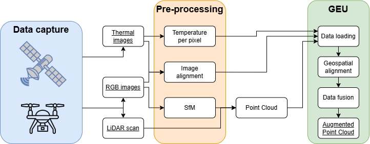
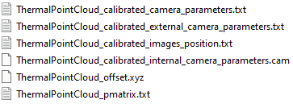
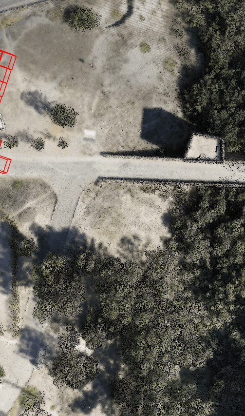
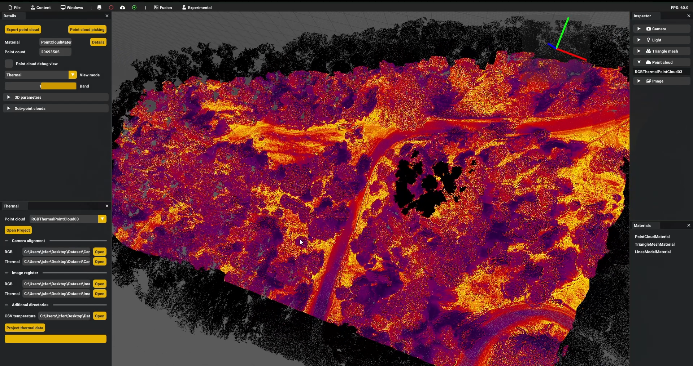

# Fusión térmica

Los datos térmicos presentan la ventaja de ser lo más livianos y fáciles de tratar, pues solo incorporan un valor de temperatura por píxel. Una imagen térmica no es más que una imagen ráster normal y corriente, con un valor adicional de temperatura. Cabe destacar que la salida directa de los sensores suele utilizar una escala de grises como paleta de color, pero estas imágenes se recolorean con otros gradientes de color para facilitar su visualización.

En cuanto al proceso de fusión, la siguiente imagen desglosa el flujo de los datos involucrados desde su captura hasta su procesamiento con GEU:



En primer lugar, la nube de puntos puede obtenerse de dos formas: mediante un escaneo LiDAR o aplicando un procedimiento de *Structure from Motion* a un conjunto de imágenes RGB; ambas alternativas pueden utilizarse indistiguiblemente desde GEU según la disponibilidad del conjunto de datos (en ocasiones, alguno no estará disponible).

Respecto a la información térmica, el sensor se encarga de captar una imagen y asignar a cada píxel un valor de temperatura, resultando en un conjunto de imágenes ráster. Al utilizar drones, es típico disponer de cientos de imágenes para un único vuelo. Con objeto de simplificar el acceso a la temperatura en cada píxel, parte del preprocesamiento extrae esta información a un fichero general estructurado, reduciendo el proceso de lectura posterior con GEU. Al utilizar cámaras térmicas del fabricante *FLIR*©, la herramienta [FlirImageExtractor](https://github.com/fclairec/FlirImageExtractor) permite extraer y convertir la información térmica del conjunto de datos obtenido por el sensor.

{: .highlight}
> Al cambiar la cámara térmica utilizada, el proceso de fusión térmica en GEU no soporta las tomas más recientes: es necesario actualizar el método incorporando una compatibilidad genérica.

Considerando el uso de drones *DJI*©, este fabricante incorpora múltiples ficheros con ajustes y correcciones de las imágenes que capturan sus cámaras integradas; en nuestros conjuntos de datos, estos son tanto las imágenes RGB como las térmicas.



Cada uno de los ficheros anteriores cuenta con una estructura propia, con información general sobre la cámara o específica a cada imagen tomada:

```
> calibrated_camera_parameters.txt

fileName imageWidth imageHeight 
camera matrix K [3x3]
radial distortion [3x1]
tangential distortion [2x1]
camera position t [3x1]
camera rotation R [3x3]
camera model m = K [R|-Rt] X
```

```
> calibrated_external_camera_parameters.txt

imageName X Y Z Omega Phi Kappa
```

```
> calibrated_images_position.txt

imageName UTM_X UTM_Y UTM_HEIGHT
```

```
> calibrated_internal_camera_parameters.cam

#Focal Length (mm) assuming a sensor width of ...
#Image size ... pixel
FOCAL ...

#Principal Point Offset xpoff ypoff in mm (Inpho)
...
#Principal Point Offset xpoff ypoff in mm 
...
#Principal Point Offset xpoff ypoff in pixel 
...

#How many fiducial pairs (max 8):
NUM_FIDS ... 

#Fiducials position
DATA_STRIP_SIDE ...

#Fiducial x,y pairs in mm:
FID_PAIRS
    ...

#Symmetrical Lens Distortion Odd-order Poly Coeffs:K0,K1,K2,K3
...

#Decentering Lens Coeffs p1,p2,p3
...

#How many distortion pairs (max 20):
...
```

```
> offset.xyz

UTM_X UTM_Y UTM_HEIGHT
```

```
> pmatrix.txt

imageName Pmatrix
```



En este punto, todos los datos se encuentran preparados para incorporarse en GEU y realizar el proceso de fusión. Como primer paso, las imágenes deben alinearse en el mismo sistema de coordenadas, para lo cual se recurre a las transformaciones definidas por los ficheros anteriores. A continuación, ambos conjuntos de imágenes, RGB y térmicas, se vinculan entre sí asignando las parejas tomadas en la misma posición del dron durante el vuelo. Cada imagen térmica, una vez se conoce su correspondiente imagen RGB, debe deformarse hasta igualar su resolución; este proceso queda resuelto utilizando el [método *ECC* de alineamiento con OpenCV](https://learnopencv.com/image-alignment-ecc-in-opencv-c-python/).

Con todas las imágenes alineadas, vinculadas y con el mismo tamaño, la fusión sobre una nube de puntos es realizada mediante la proyección de cada punto al píxel correspondiente. 
Para realizar esta proyección, GEU recorre la posición de la cámara en cada imagen capturada y selecciona un subconjunto de puntos de la nube dentro de un radio cercano utilizando un *octree*. Así, solo es necesario procesar un subconjunto de puntos al añadir los valores de temperatura, en lugar de examinar toda la nube cada vez.

El resultado de la fusión incorpora un nuevo valor a cada punto, que puede utilizarse como parámetro al ser visualizado junto a, por ejemplo, un gradiente de color:


