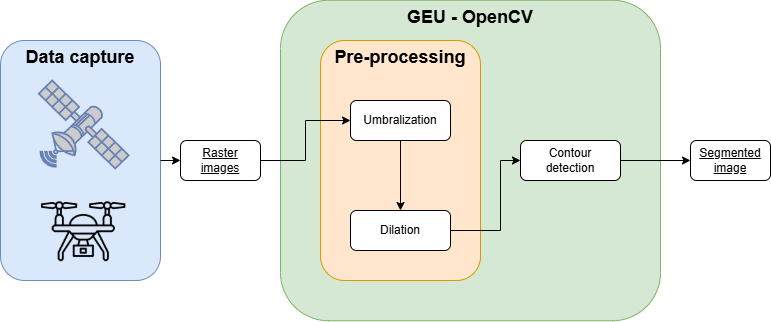
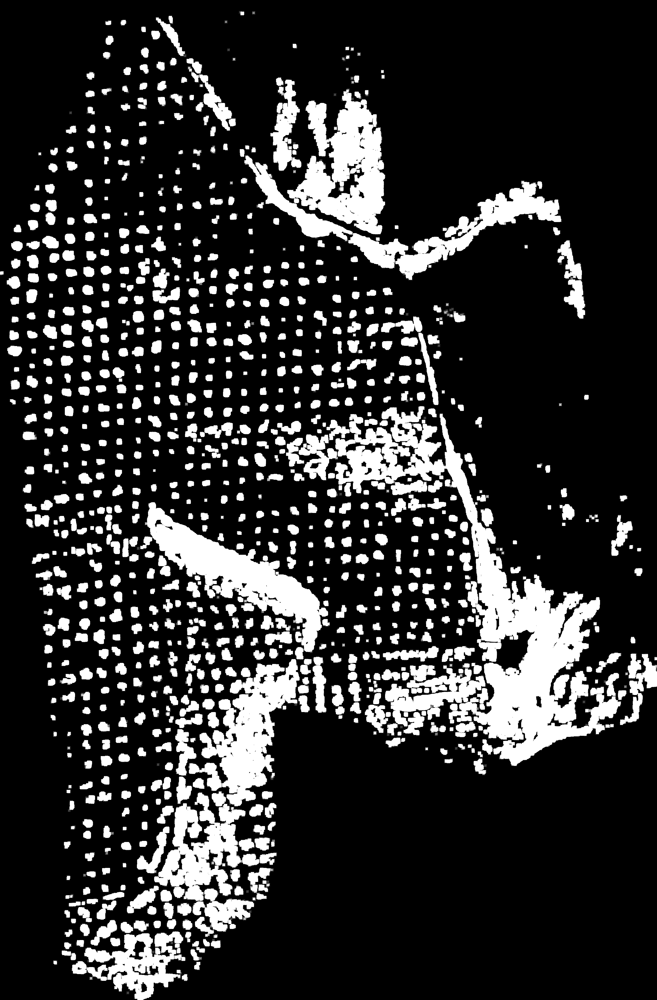

Aunque GEU destaca por su soporte para nubes de puntos 3D, también permite operar con imágenes ráster. Una de las aplicaciones del manejo de imágenes es la segmentación de individuos, por la cual distinguir una serie de regiones de interés del resto de píxeles. Esto es especialmente útil al trabajar con imágenes satelitales sobre zonas de cultivo, pues cada individuo estará considerablemente separado del resto (especialmente, para el caso de plantaciones de olivar).

El proceso de segmentación queda implementado mediante la abstracción de varios métodos de *OpenCV*, añadiendo una serie de pasos previos que facilitan la detección de las regiones de interés:

    

## Preprocesamiento en GEU

Partiendo de una imagen ráster de entrada, idealmente con un contraste elevado que resalte las zonas de interés (por ejemplo, índices de vegetación), GEU realiza dos fases de preprocesamiento que mejoran las cualidades de la imagen para facilitar la detección de regiones. Para mostrar un ejemplo del funcionamiento, las siguientes imágenes muestran el cultivo de olivar empleado: a la izquierda, la captura aérea RGB; a la derecha, la clasificación asignada a cada píxel entre suelo (azul), vegetación inferior (rojo) y árboles (verde).

    
    

### Umbralización

En primer lugar, la imagen se convierte a un esquema de color blanco y negro, haciendo uso de la función <a href="https://docs.opencv.org/3.4/d7/d4d/tutorial_py_thresholding.html"><code>threshold</code> de OpenCV</a>. Aunque esta función cuenta con varios métodos para reasignar valores a cada píxel, tratamos únicamente con umbralización binaria, generando imágenes en blanco y negro sin grises intermedios.

Definiendo un valor como umbral y seleccionando el canal de color a utilizar como entrada, la asignación de cero o uno se hará sobre todos los píxeles según sean inferiores o no al umbral, respectivamente. Gracias a este paso, solo las zonas deseadas quedan en la imagen umbralizada: al tratar con capturas RGB es posible que el uso de los canales básicos no sea suficiente para eliminar ese ruido y, por tanto, debe ajustarse previamente la imagen resaltando las zonas de interés. Para nuestro ejemplo, tomando el canal verde para la umbralización es suficiente.

### Dilatación

Al tratar con imágenes de entornos naturales captadas sobre áreas muy extensas, muchas regiones quedan representadas por un número reducido de píxeles que dificulta su detección. Además, otras regiones que cuenten con contornos irregulares o ruido (como ocurre especialmente en vegetación) serán también un punto débil de cualquier algoritmo. Una manera de minimizar el impacto de ambas situaciones consiste en dilatar los píxeles de toda la imagen, haciendo "crecer" las regiones en blanco de la imagen.

Desde la imagen umbralizada, se aplica el filtro de dilatación con la función <a href="https://docs.opencv.org/3.4/db/df6/tutorial_erosion_dilatation.html"><code>dilate</code> de OpenCV</a> (el enlace incorporado presenta también la operación inversa <code>erode</code>). Respecto a sus parámetros, requiere especificar un núcleo o <i>kernel</i> para el filtro y un número de iteraciones principalmente:

<ul>
    <li><b>Kernel</b>: Matriz cuadrada de dimensiones impares que define la influencia de cada píxel (el centro de la matriz) con su vecindario.</li>
    <li><b>Iteraciones</b>: Número de veces que se aplica el filtro con los mismos parámetros.</li>
</ul>

## Detección de regiones

En este punto, es posible recurrir a un algoritmo de detección automática que trate de retratar cada región, o árboles en nuestro caso. El objetivo final es conocer la posición en la imagen que toma cada árbol tal que pueda extrapolarse su posición real en el campo de cultivo.

OpenCV implementa la búsqueda de contornos como un método más de su librería, <a href="https://docs.opencv.org/3.4/d4/d73/tutorial_py_contours_begin.html"><code>findContours</code></a>, un algoritmo capaz de generar listados con aquellos contornos que delimiten objetos presentes en la imagen. Internamente, es implementado a partir de la búsqueda de alto contraste entre píxel adyacentes, de ahí la necesidad de utilizar imágenes umbralizadas que aseguren los mejores resultados.

De cara al usuario, GEU permite seleccionar un modo de aproximación para los contornos detectados. Esto no afecta a priori al resultado final de una forma agresiva, pero puede alterar ciertos detalles en regiones más pequeñas sobre todo.

<ul>
    <li><b>Sin aproximación</b>: Almacena todos los puntos del contorno en el resultado.</li>
    <li><b>Aproximación simple</b>: Simplifica puntos redundantes pertenecientes a líneas rectas, manteniendo únicamente los puntos del inicio y final.</li>
    <li><b>Algoritmos Teh-Chin</b>: Aplica una de las implementaciones del algoritmo de aproximación Teh-Chin. Para más información, visite <a href="https://ieeexplore.ieee.org/document/31447">la publicación del artículo</a>.</li>
</ul>

La imagen situada a la derecha de esta sección muestra el resultado de la detección automática de regiones a partir de los contornos detectados. Cada región no es más que la caja envolvente de cada región, y se muestra con un rectángulo de color oscuro en este ejemplo.

### Gestión manual de regiones

La principal desventaja de utilizar este método de segmentación se debe a la presencia de ruido y falta de precisión para situaciones específicas, originando regiones erróneas (contornos interiores, desplazados, o demasiado pequeños o grandes) o faltantes. En el resultado de la imagen anterior pueden apreciarse multitud de estos errores generados en la salida.

Con el fin de aplacar ligeramente estos casos, GEU permite gestionar manualmente las regiones sobre la misma imagen y poder deshacer los problemas mediante una herramienta para añadir, borrar o desplazar regiones. Simplemente seleccionando el tipo de herramienta, es posible interactuar con la imagen para realizar la acción indicada en tiempo real.

    

