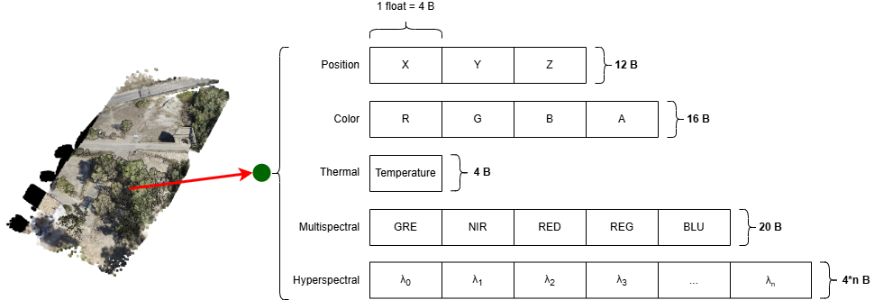

GEU dispone de un amplio conjunto de funcionalidades especializadas, dividas internamente en módulos especializados e independientes entre sí. Siguiendo este enfoque, cada desarrollador tiene libertad total durante el desarrollo del módulo que implementa. Desde GEU, cada módulo se asigna a una clase o etiqueta, y se organizan en la barra superior de menú.

## Fusión de datos

El conjunto principal de módulos son dedicados a la fusión de datos espectrales y espaciales, entre capturas multisensoriales (imágenes térmicas, multiespectrales e hiperespectrales) y nubes de puntos (*SfM* o LiDAR). Desde cada uno de estos módulos, GEU utiliza los conjuntos de datos espectrales y espaciales para dar como resultado una nube de puntos aumentada, donde cada punto incluye, además de su posición 3D, los valores espectrales captados sobre las múltiples longitudes de onda y tipos de sensor disponibles:

## Experimental

