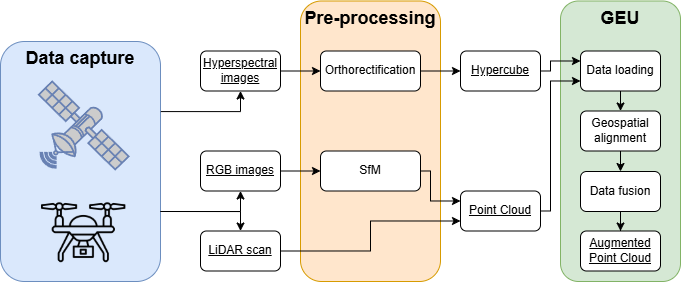

GEU dispone de un amplio conjunto de funcionalidades, dividas internamente en módulos especializados e independientes entre sí. Siguiendo este enfoque, cada desarrollador tiene libertad total durante el desarrollo del módulo que implementa. Desde GEU, cada módulo se asigna a una clase o etiqueta, y se organizan en la barra superior de menú.

## Fusión de datos

### Fusión térmica

### Fusión multiespectral

### Fusión hiperespectral

Tratar datos hiperespectrales permite un control mucho más refinado de los métodos y resultados al disponer de una cantidad mayor de información frente a conjuntos de datos térmicos o multiespectrales. Aunque disponer de más datos siempre es positivo ante tareas de análisis, su impacto en el sistema impide, en muchas situaciones, manejar toda la información simultáneamente (es común encontrar hipercubos cuyo tamaño alcanza las decenas de GB).

El proceso de fusión de un hipercubo sobre una nube de puntos 3D se muestra en la siguiente imagen: primero, el conjunto de datos se extrae de las fuentes originales (sensores sobre drones o satélites) en forma de imágenes hiperespectrales, imágenes RGB o nubes de puntos LiDAR; a continuación, las imágenes RGB son preprocesadas aplicando un método de *Structure from Motion* (*SfM*) para obtener una nube de puntos de la zona capturada, a la par que las imágenes hiperespectrales reciben una ortorectificación que facilite alinearlas sobre un mismo sistema de coordenadas, dando lugar al hipercubo; por último, el hipercubo y la nube de puntos se cargan en GEU para comenzar el proceso de fusión, que requiere la alineación de ambos conjuntos de datos mediante su posición geográfica. Al finalizar, este proceso devuelve una nube de puntos aumentada con información hiperespectral en cada punto sobre todas las longitudes de onda captadas.

## Experimental

