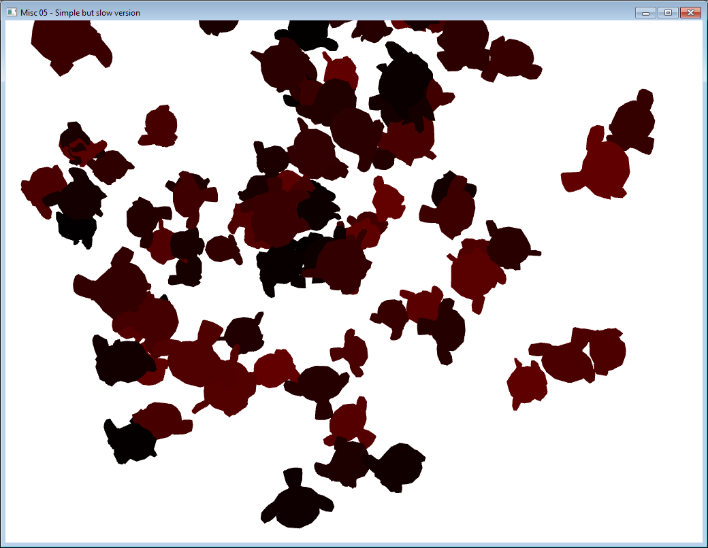
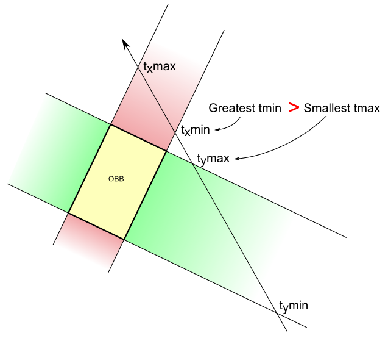
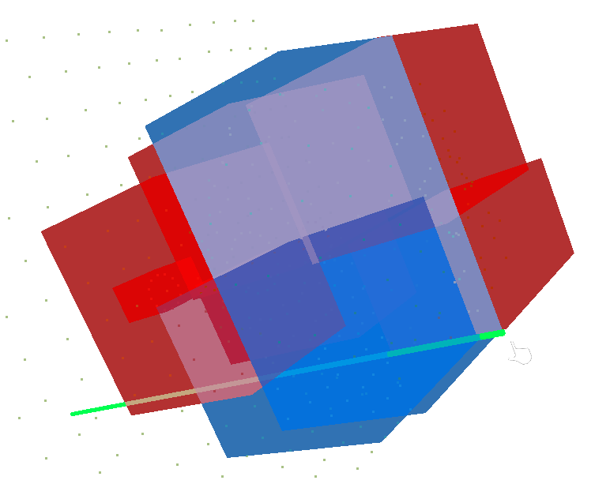

Además de hacer uso del *meshlet* como método de optimización para el proceso de renderizado, GEU también aprovecha esta estructura a la hora de permitir al usuario seleccionar puntos sobre la escena 3D. Los algoritmos clásico de selección se diferencian por usar técnicas distintas: una primera opción, la selección por color, consiste en generar una imagen en la que se coloree cada objeto visible de un color distinto, y marcando como seleccionado aquel cuyo color corresponda al del píxel seleccionado; por otro lado, la selección mediante lanzamiento de rayos es capaz de seleccionar el primer objeto que intersecte un rayo lanzado desde la cámara virtual.

|||
|:-:|:-:|
|Ejemplo de selección por color en una escena 3D. Extraído de [https://www.opengl-tutorial.org/miscellaneous/clicking-on-objects/picking-with-an-opengl-hack/](https://www.opengl-tutorial.org/miscellaneous/clicking-on-objects/picking-with-an-opengl-hack/)|Intersección de un rayo con una caja envolvente orientada. Extraído de [https://www.opengl-tutorial.org/miscellaneous/clicking-on-objects/picking-with-custom-ray-obb-function/](https://www.opengl-tutorial.org/miscellaneous/clicking-on-objects/picking-with-custom-ray-obb-function/)|

La selección por color presenta un claro problema de escalabilidad, pues el número de colores distintos es limitado. Aunque es escenas no muy extensas es de gran utilidad y no suele alcanzarse este límite, al trabajar con nubes de puntos, cada uno debe recibir un color y rápidamente se excede dicho límite. Por este motivo, GEU implementa el lanzamiento de rayos durante la selección de puntos en pantalla, pero aplicando algunas optimizaciones adicionales según el tipo de selección.

### Selección individual

Aunque en los casos de uso más comunes de GEU no es prioritaria la selección de puntos individuales, puede ser de utilidad en otras muchas ocasiones. Como algoritmo clásico mediante trazado de rayos, el proceso consiste en comparar la distancia de todos los puntos al rayo y tomar el más cercano al mismo:

```c
Ray r = (cameraPosition, cameraDirection)
Point nearestPoint
float nearestDistance
for Point p in pointCloud:
 float distance = distance(p, r)
 if distance < nearestDistance:
  nearestDistance = distance
  nearestPoint = p
```

<div class="vflex-center">
<div>
<p>
Una vez más, aparece el problema de la densidad de puntos en las escenas utilizadas; comparar individualmente uno a uno contra millones de puntos ralentiza drásticamente el tiempo de respuesta de la aplicación. Ante este problema, el uso de estructuras de datos espaciales como <i>octrees</i> o <i>kd-trees</i> añade coherencia espacial a toda la escena, acelerando los procesos de búsqueda de objetos. Si bien estas soluciones son óptimas en situaciones generales, GEU hace un uso intensivo de los recursos del sistema, especialmente la memoria principal, y dichas estructuras espaciales incrementan esos requisitos.
</p>
<p>
Con el fin de evitar el uso de estructuras adicionales, la selección de puntos individuales aprovecha los <i>meshlets</i> generados. Cada <i>meshlet</i> agrupa cierta cantidad de puntos cercanos espacialmente, por lo que puede representarse con la caja envolvente o <i>AABB</i> formada por todos los puntos que contiene. Al realizar la selección, en lugar de comprobar el rayo contra cada punto, se comprueba su intersección contra todos los <i>meshlets</i>; aquellos en que intersecte serán los que definen qué puntos utilizar al medir su proximidad al rayo.
</p>
</div>

</div>

### Selección de área

La situación más común para la selección de puntos consiste en marcar un área de la pantalla y seleccionar todos los puntos contenidos en ella; esto presenta una mayor utilidad considerando el contexto de GEU, pues permite, por ejemplo, seleccionar árboles individuales en su totalidad. Este proceso sigue un enfoque basado en la proyección de la escena.

Para cada punto de la nube, su posición 3D es proyectada al plano 2D de la cámara virtual, siguiendo el mismo proceso que durante el dibujado mediante su matriz de proyección (generada a partir de los parámetros de la cámara):

```c
Mat4x4 projectionMatrix = glm::perspective(fovY, aspectRatio, zNear, zFar)
// For orthogonal view, glm::ortho(...) is used
for Point p in pointCloud:
 Vec4 projectedPosition = projectionMatrix * Vec4(p.x, p.y, p.z, 1.0)
 projectedPosition /= projectedPosition.w // Correct scaling
 projectedPosition = (projectedPosition + 1.0) * 0.5 // Move to [0,1] range
 projectedPosition.y = 1.0 - projectedPoint.y // Invert Y axis
 Vec2 planePosition = (projectedPosition.x * viewWidth, projectedPosition.y * viewHeight)
 ...
```

Esta posición 2D en pantalla se utiliza para comprobar si está englobada en el rectángulo de la selección, definido por sus esquinas extremas:

```c
...
 for Point p in pointCloud:
 ...
 Vec2 planePosition = (projectedPosition.x * viewWidth, projectedPosition.y * viewHeight)
 if checkPointInRect(planePosition, selectionRect.minPoint, selectionRect.maxPoint):
  // Point is inside, mark as selected
 else:
  // Point not in selection rect, ignore and continue
```

Pese a no incluir optimizaciones adicionales como la selección individual, este proceso es suficientemente rápido para mostrar un tiempo de respuesta aceptable en las escenas utilizadas. Este enfoque, a priori, también puede aplicarse durante la selección de un punto individual, pues no perjudica en exceso al rendimiento, pero al proyectar cada punto sobre el plano 2D se elimina la información de profundidad, complicando elegir el punto más cercano a la cámara.
