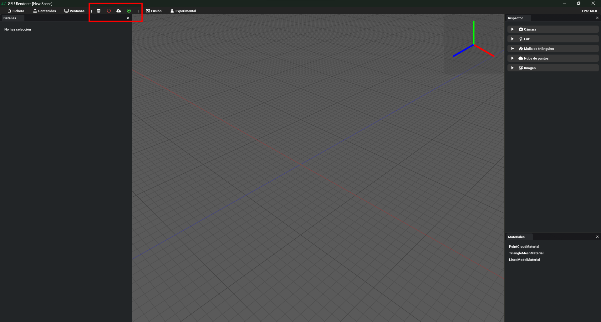
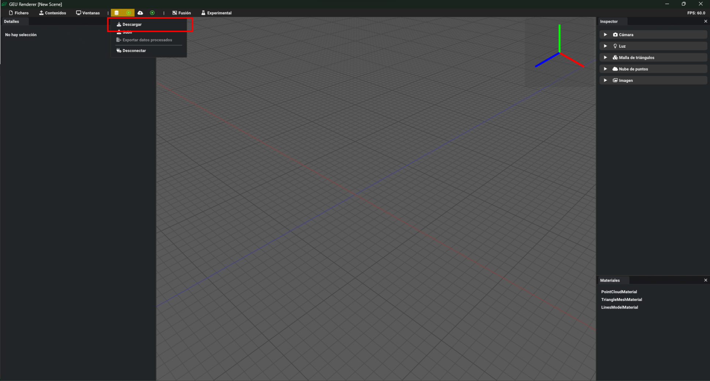
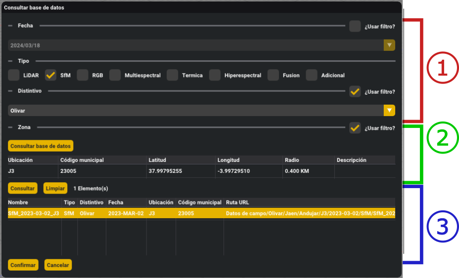
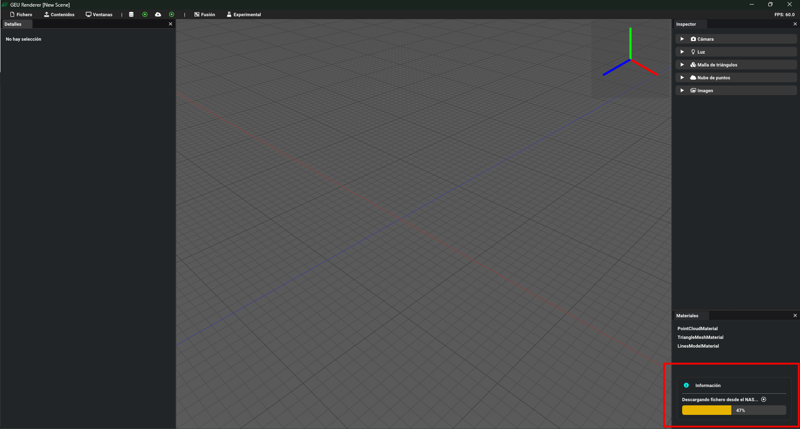
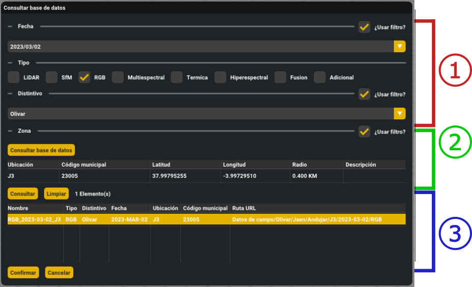

# Descarga y visualización de datos

Este ejemplo muestra el proceso de búsqueda y descarga de los datos relativos a una parcela concreta desde GEU, accediendo a la base de datos y servidor de almacenamiento NAS remotos. Tras la descarga, se procede a la visualización con los datos seleccionados.

## Conexión a los servidores

Para empezar, debe establecerse la conexión a los servidores remotos. Por defecto, GEU tratará de conectarse automáticamente al servidor NAS nada más ejecutarse. Ambos servidores solo son accesibles desde la red interna de la Universidad de Jaén; cualquier intento de conexión fuera de ella no dará resultados. Si tiene alguna duda sobre el estado y control de las conexiones, vea la página [Base de datos remota](/Usuario/Manual/BaseDeDatos/).



Después de iniciar sesión con sus credenciales de usuario o las credenciales por defecto de GEU, puede acceder a la funcionalidad sobre la base de datos para consultar la información.



## Datos espaciales - Nube de puntos

En este ejemplo, utilizaremos los datos de la finca **J1**. Concretamente, buscaremos la nube de puntos RGB generada mediante SfM para cargarla y visualizarla en GEU. En la siguiente imagen se etiqueta cada paso a seguir al rellenar el formulario con los filtros para la consulta, detallando a continuación cada una de estas secciones:

1. **Fecha, Tipo y Distintivo**: Filtros básicos para limitar los resultados según una fecha, tipo de dato o distintivo concretos. En el caso de la fecha, debe activarse la casilla **¿Usar filtro?** para que tenga efecto al realizar la consulta.

   <ins>Para este ejemplo</ins>, no es necesario marcar el filtro para fecha, y activamos el tipo *SfM*. También establecemos el distintivo *Olivar* pues conocemos que la finca tratada corresponde al cultivo de olivar.

2. **Zona**: Filtro sobre el lugar de toma del dato, detallado a nivel de *Provincia*, *Municipio*, o *Zona* concreta. Al igual que la fecha, debe activarse la casilla **¿Usar filtro?** para que tenga efecto. La información de los desplegable se obtiene automáticamente al abrir esta ventana, limitando los posibles valores a aquellos contemplados en la base de datos.
    
    <ins>Para este ejemplo</ins>, conocemos la zona sobre la cual trabajaremos, por lo que activarmos este filtro y seleccionamos la *Provincia*, *Municipio* y *Zona* correspondientes. En el caso de *J3*, se encuentra en el municipio *Andújar* en la provincia de *Jaén*.

3. **Selección**: Tras encontrar el dato deseado, basta con seleccionarlo en el listado mediante clic principal del ratón y se activará el botón **Confirmar**. Utilizando este botón comenzará la descarga del dato.

    <ins>Para este ejemplo</ins>, seleccionamos la fila del dato correspondiente. Según la cantidad de datos almacenados en los servidores y los filtros que aplique, aparecerán una, varias o ninguna fila.





## Datos espectrales - Imágenes y adicional

Junto a la nube de puntos, descargaremos también las imágenes *RGB* tomadas en el mismo vuelo. Al igual que en la sección anterior, a continuación se listan los parámetros empleados en el formulario de consulta:

{: .highlight }
> Para la descarga de varios datos, debe seleccionar y descargarlos uno a uno, **no es posible seleccionar múltiples entradas** del listado y realizar su descarga en conjunto.


1. **Fecha, Tipo y Distintivo**
   
   <ins>Para este ejemplo</ins>, marcamos el filtro de fecha para extraer todos los datos relativos al mismo vuelo y evitar incongruencias, especificando el día **2 de marzo de 2023**. En el tipo, seleccionamos *RGB*, pues será el que utilizaremos en el próximo ejemplo ([Subida de datos a los servidores](/Usuario/Ejemplos/SubidaDeDatos/)). Como distintivo, mantenemos *Olivar*.

2. **Zona**
    
    <ins>Para este ejemplo</ins>, la zona continúa siendo la misma que anteriormente, por tanto no varía.

3. **Selección**

    <ins>Para este ejemplo</ins>, seleccionamos la fila con los datos a descargar.



## Resultados

Una vez finalizada la descarga, el fichero o carpeta queda almacenado junto al directorio de GEU en una carpeta temporal *Cache*. Esta carpeta sigue el mismo esquema presente en el servidor NAS:
```
/GEU/Cache/Datos de campo/Distintivo/Provincia/Municipio/Ubicacion/Fecha/Tipo/
```

En este ejemplo, los ficheros quedarán almacenados en los siguientes directorios.
```
/GEU/Cache/Datos de campo/Olivar/Jaen/Marmolejo/J3/2023-03-02/SfM
/GEU/Cache/Datos de campo/Olivar/Jaen/Marmolejo/J3/2023-03-02/RGB
```

Al descargar nubes de puntos, GEU abrirá el fichero automáticamente una vez finaliza la descarga, añadiendo la nube a la escena activa. Para más información sobre el manejo de la escena, vea la página [Gestor de escenas](/Usuario/Manual/GestorDeEscenas/).

