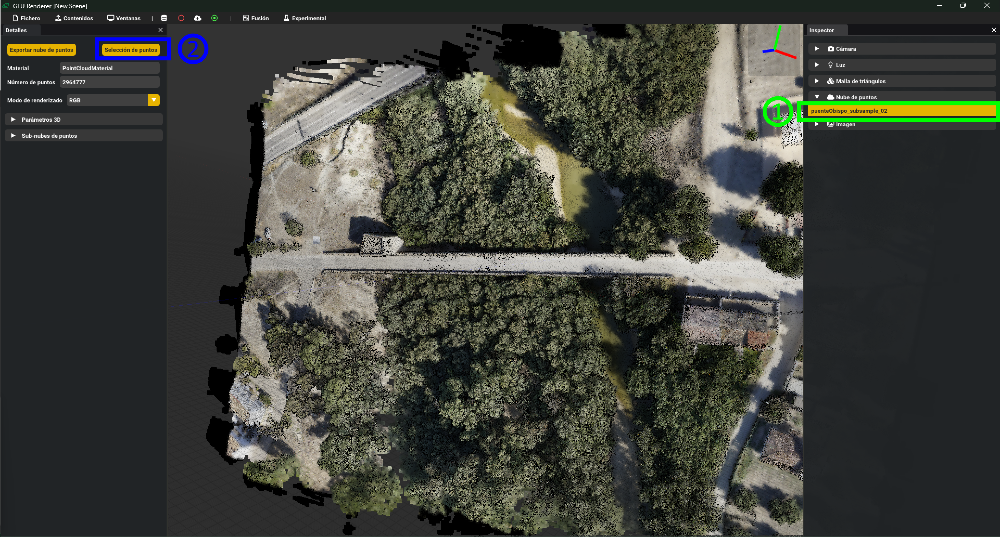
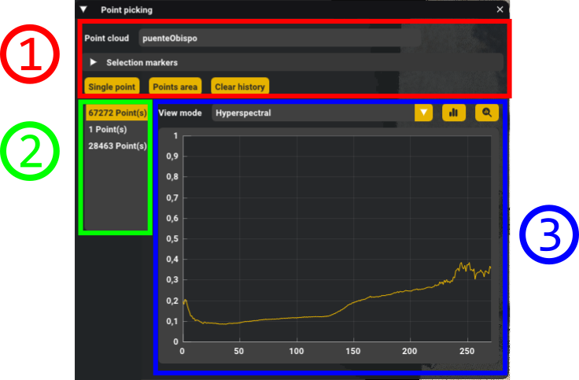
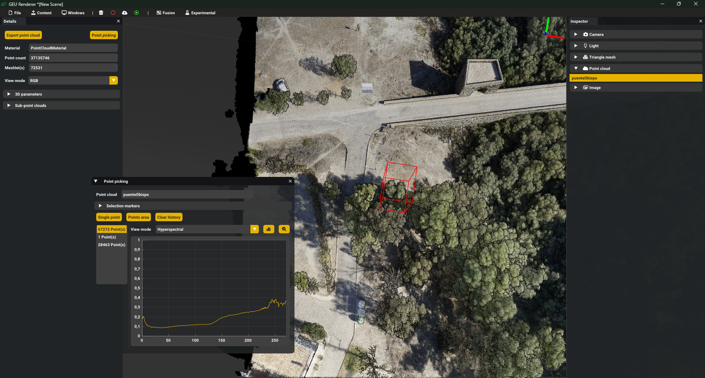

# Selección de puntos

Ciertos procesos relacionados al uso de nubes de puntos requieren trabajar con un subconjunto de puntos en lugar de la nube en su totalidad. En las siguientes secciones quedará detallado el procedimiento para, tras cargar una nube de puntos en GEU, realizar una selección de forma interactiva mediante el puntero sobre la pantalla.

## Carga de la nube y ventana de selección

Como primer paso, debe cargar una nube de puntos en la aplicación mediante cualquier método, tal que aparezca en el inspector de la escena activa. Utilizando el clic principal sobre la entrada de la nube en este listado mostrará los detalles sobre la nube, entre los que se incluye el botón "Selección de puntos" para abrir la ventana de selección.

Esta ventana se compone de múltiples controles. A continuación se listan los detalles sobre cada una de las regiones marcadas en la imagen de muestra:

1. **Información de la nube y selección**: Nombre de la nube sobre la que se realiza la selección, parámetros de visualización de selecciones y botones de control. Tras clicar en el tipo de selección deseada (más información en la siguiente sección), provoca que GEU utilice la próxima acción sobre la nube de puntos para el proceso de selección. El botón "Limpiar historial" (o "Clear history") borrará el listado del historial de selecciones previas.
2. **Historial de selección**: Listado con los resultados de selecciones previas, indicando la cantidad de puntos seleccionados. Seleccionando una entrada restablecerá el resumen de estadísticas y marcará sobre la nube la caja envolvente de los puntos.
3. **Resumen espectral**: Si la nube de puntos cuenta con información hiperespectral, la ventana mostrará una gráfica representando los valores de reflectancia agregados entre todos los puntos para cada banda. Para ello, debe seleccionarse el tipo de dato desde el desplegable y presionar uno de los botones para comenzar el proceso. Ambos botones realizan la misma operación a distintos niveles de precisión: con un resumen de los datos espectrales (mayor rendimiento pero induce una tasa mínima de error), o con los datos originales (no incorpora error pero requiere un largo tiempo de cómputo).

## Modos de selección

GEU permite dos formas de seleccionar puntos interactivamente: puntos individuales o un área de puntos. En el caso de un punto individual, basta con realizar un clic con el botón principal del ratón sobre la nube y el sistema seleccionará el punto más cercano. Para la selección en área, pulse y mantenga el botón principal del ratón para marcar un rectángulo sobre la nube de puntos; al soltar el botón, todos los puntos dentro de este área serán seleccionados.

{: .note }
El tamaño del área seleccionada influye en el tiempo de respuesta de la selección: seleccionar gran parte de la nube de puntos puede tomar varios minutos.

||
|:-: |.
|Resultado de la selección de un área de puntos|

<!-- # Análisis espectral

Uno de los usos para la selección de un subconjunto de puntos consiste en realizar un análisis a menor escala sobre la información espectral fusionada en la nube. Dado el gran tamaño de los datos fusionados, trabajar con la totalidad de los mismos requiere tiempos de ejecución excesivos y un alto uso de los recursos del sistema; esto se solventa limitando el conjunto de datos a un subconjunto mucho menor seleccionado manualmente.

{: .warning }
La visualización espectral se encuentra limitada a datos hiperespectrales.

Desde la propia ventana de selección, al marcar un entrada del historial se mostrará una gráfica sobre la cual pueden visualizarse los datos espectrales. Sobre esta, el selector desplegable permite elegir qué tipo de información consultar, y los botones junto a este acceden y generan la gráfica con los datos asociados. -->
