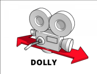
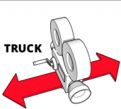
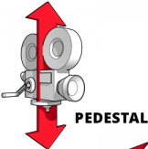
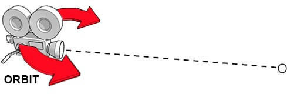
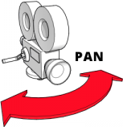
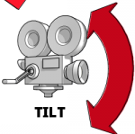

# Control de la cámara

| Tecla                                  | Acción                                                                                     |
|:--------------------------------------:|:------------------------------------------------------------------------------------------:|
| W,S                                    |                                              |
| A,D                                    |                                              |
| Up, Down                               |                                           |
| Q,E                                    | Rotación lateral                                                                           |
| Botón izquierdo del ratón + movimiento |                                              |
| Botón derecho del ratón + movimiento   |   |
| Botón central del ratón + movimiento   |                                           |
| Rueda del ratón                        | Zoom                                                                                       |