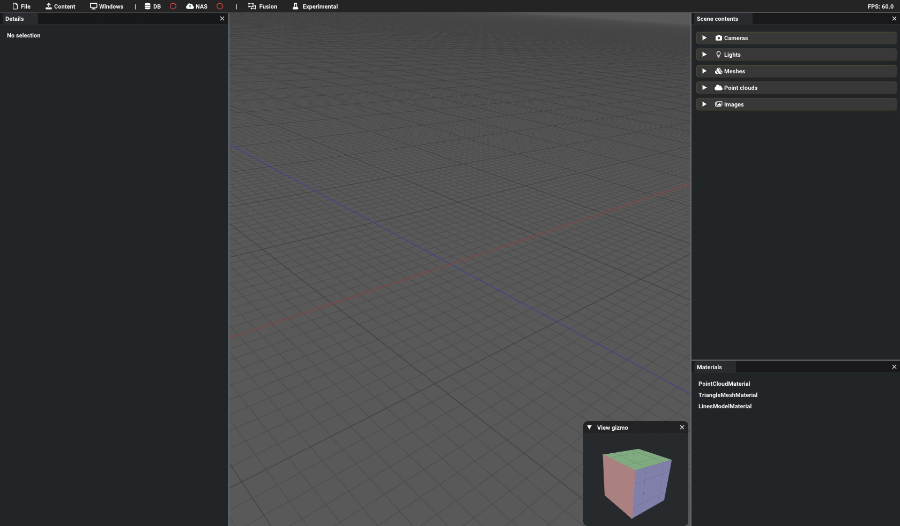
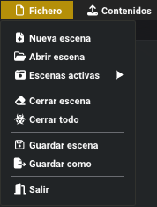
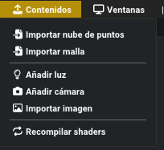

# Interfaz de usuario

La interfaz de usuario de GEU persigue la distribución de otros softwares de similar índole como Blender o Unity. En el lateral derecho de la imagen se pueden ver la jerarquía de la escena, con todas las entidades cargadas, clasificadas por categorías. 

|                                                                           |
|:-------------------------------------------------------------------------------------------------------------------------:|
| *Imagen de la interfaz de usuario. Puede variar dependiendo de la versión del software y distribución de ventanas usada.* |

## Ventanas

Cada una de las ventanas lleva asociado un propósito específico dentro de la aplicación:

* **Inspector**: Listado con los contenidos de la escena activa.
* **Detalles**: Detalles del elemento del inspector seleccionado.
* **Materiales**: Listado de materiales generados en la aplicación.
* **Estadísticas**: Información general sobre el rendimiento de la aplicación.
* **Ajustes**: Propiedades generales de la aplicación.

Las ventanas **Estadísticas** y **Ajustes** presentan un funcionamiento simple y básico, y, generalmente, no será necesario su uso. Para las otras ventanas, vea la página [Gestor de escenas](/Usuario/Manual/GestorEscenas) para obtener más información sobre su función.

## Barra superior de menú

La mayor parte de la funcionalidad de GEU queda accesible desde los múltiples botones y menús de esta barra superior, disponible en casi todo momento:

* **Fichero**: Opciones generales para la gestión de escenas. Permite la creación, guardado y borrado de escenas, así como navegar entre las escenas cargadas.
* **Contenido**: Opciones de carga o creación de elementos para la escena activa. Permite cargar diversos tipos de fichero: nubes de puntos (PLY, LAS/LAZ), modelos 3D (OBJ) e imágenes (PNG); además de la creación de nuevas cámaras y luces virtuales.
* **Ventanas**: Desplegable para la visualización de las ventanas disponibles. Activa o desactiva las ventanas esenciales detalladas en la sección anterior [Ventanas](#ventanas).
* **Conexiones remotas**: Submenú para la gestión y tratamiento de conexiones con BBDD y NAS. Permite realizar la conexión y desconexión con los servidores remotos, así como consultar y descargar la información que almacenan.
* **Módulos**: Colección de desplegables para el acceso a funcionalidad específica.

|  |
|:-------------------------------------------------------------------------------------------------------------------------:|
|*Contenido de los menús **Fichero**, **Contenido** y **Ventanas***|

